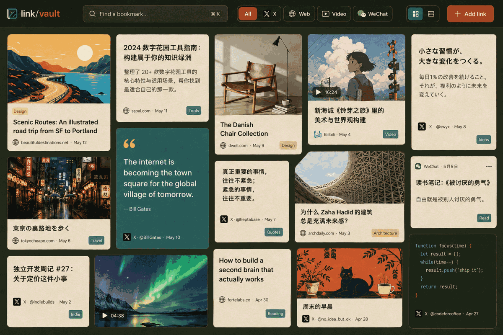

# link/vault

A visual archive for saved links — not a knowledge base.

**[Open the bookmark archive →](https://guchengwei.github.io/link-vault/)**



`link-vault` turns captured web content into a fast, static bookmark site. Save a URL, keep a readable local copy, and browse the collection by source, date, or search.

## The bookmark experience

- visual masonry grid with captured images and readable text fallbacks
- instant search across titles, summaries, authors, and domains
- source filters for X, web pages, Bilibili, YouTube, and WeChat
- grid and compact list views
- local detail pages for every saved item
- responsive layout with no runtime backend

## Save a link

Use `xfetch` as the canonical capture and publish pipeline:

```bash
python3 -m xfetch save "https://example.com/article" \
  --content-root ./content-out \
  --json
```

With a publish target configured:

```bash
export XFETCH_TARGET_REPO=/path/to/link-vault
export XFETCH_REPO_OWNER=guchengwei
export XFETCH_REPO_NAME=link-vault

python3 -m xfetch save "https://example.com/article" \
  --content-root ./content-out \
  --json
```

## Publishing flow

```text
URL → xfetch capture → content bundle → Link Vault renderer → GitHub Pages
```

`xfetch` owns capture, bundle creation, and sync. This repository owns the public archive renderer and the saved content it publishes. GitHub Pages serves the generated `site/` output.

Each bundle contains:

- `document.json` — source, author, timestamps, publish metadata, and optional card fields
- `index.md` — the readable captured content
- images and other captured media when available

## Better bookmark cards

The renderer accepts optional presentation metadata without requiring it:

```json
{
  "card": {
    "title": "A concise, durable title",
    "opening": "One useful sentence that explains why this link matters.",
    "image": "images/cover.jpg",
    "diagram": "images/diagram.png"
  }
}
```

The card can use a generated front image, a useful diagram, or a strong opening phrase. Existing bundles continue to work: Link Vault falls back to captured images and extracted text.

## Local tools

The repository still supports local CLI bookkeeping and semantic search when useful, but those are secondary to the bookmark site:

```bash
python -m linkvault ingest https://example.com/article
python -m linkvault search "machine learning"
python -m linkvault list
python -m linkvault stats
```

Build the static archive locally:

```bash
python -m linkvault.site_builder
python -m http.server 8000 --directory site
```

Then open <http://localhost:8000>.

## Environment

`xfetch` must be available on `PATH`, or configured with `XFETCH_CMD` or `LINKVAULT_XFETCH_CMD`.

Publishing uses:

- `XFETCH_TARGET_REPO`
- `XFETCH_REPO_OWNER`
- `XFETCH_REPO_NAME`

Optional defaults:

- `XFETCH_BRANCH`
- `XFETCH_CONTENT_SUBDIR`
- `XFETCH_SITE_SUBDIR`

## Live site

<https://guchengwei.github.io/link-vault/>
