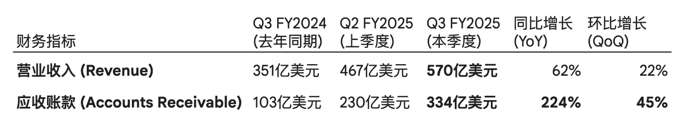
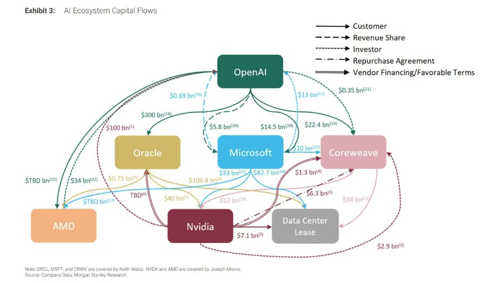

# 到底是AI泡沫还是AI革命？ —— Q3FY26 英伟达财报的唱空观点集锦

- Source: https://x.com/agintender/status/1991890344653570186
- Author: @agintender
- Created: 2025-11-21T15:24:00Z

到底是AI泡沫还是AI革命？ —— Q3FY26 英伟达财报的唱空观点集锦

英伟达在11月19日公布了Q3财报，虽然不能说成绩斐然，也能说是超出预期。问题是，如此的成绩单，市场却不买单，在上涨5%后开始急跌。很多币圈的小伙伴都是一脸懵。本文尝试从唱空者的视角来汇总、解读和分析这篇看似

英伟达在11月19日公布了Q3财报，虽然不能说成绩斐然，也能说是超出预期。问题是，如此的成绩单，市场却不买单，在上涨5%后开始急跌。很多币圈的小伙伴都是一脸懵。本文尝试从唱空者的视角来汇总、解读和分析这篇看似“好到不可思议”的财报有什么不可告人之处。

另外，唱多的文章有太多了，我这里就不赘述了。

本文文长4000字左右，如果你懒得看长文的话，核心的几个唱空观点如下，拿走不谢 🤣：

循环融资制造营收：Nvidia 通过投资xAI等客户，构建了资金回流闭环，将投资款转化为自身的账面收入，缺乏实质性现金交付。

应收账款异常激增：应收账款余额达334亿美元，增速远超营收，且周转天数计算存在掩饰嫌疑，暗示了严重的“渠道塞货”和后端装载现象。

库存与叙事背离：在“供不应求”的叙事下，产成品库存却意外翻倍，提示潜在的客户推迟提货或产品滞销风险。

现金流倒挂：经营性现金流显著低于净利润，证明公司利润主要停留在账面，未转化为真金白银

免责声明：本文并不构成任何投资建议。这篇文章只是一篇观点合集。

————————————————正文开始——————————————

1. 循环收入和供应商融资模式

1.1 资金流向的闭环机制

背景：2025年11月，Elon Musk的xAI完成了200亿美元融资轮，其中Nvidia直接参与了约20亿美元的股权投资，但是这并不是简单的“投资行为”。跟着逻辑一步步来：

资本流出（投资端）：Nvidia从其资产负债表中划拨现金（约20亿美元），计入“非适销权益证券投资”（Purchases of non-marketable equity securities），作为对xAI或相关SPV的股权注资 。这笔资金流出体现在现金流量表的“投资活动”项下。

资本转化（客户端）：xAI接收这笔资金，将其作为购买GPU集群（即Colossus 2项目，涉及10万块H100/H200及Blackwell芯片）的首付款或资本支出预算 。

资本回流（收入端）：xAI随即向Nvidia发出采购订单。Nvidia发货并确认“数据中心收入”。

财务结果：Nvidia实际上是将自己资产负债表上的“现金”资产，通过xAI这一中介，转化为了利润表上的“营收”和“净利润”。

这种操作虽然在会计准则（GAAP）下通常是允许的（只要经过评估），但这其实是一种“低质量收入”（Low-Quality Revenue）（IFRS在这里表示不服，只求一战🤣）

这也是Michael Burry等空头诟病的，因为这种“几乎所有客户都由其供应商资助”的模式是泡沫后期的典型特征 。当一家公司的收入增长依赖于其自身的资产负债表扩张时，一旦其停止对外投资，其营收增长也将随之枯竭。 （是不是有点币圈套娃的感觉了？）

1.2 SPV的杠杆效应与风险隔离

如果你觉得循环收入模式有点惊艳，那交易中涉及的特殊目的实体（SPV）结构可能会让你更大开眼界。

据新闻报道，xAI的融资包括股权和债务，债务部分通过SPV构建，该SPV主要就是用来购买Nvidia处理器并将其租赁给xAI 。

SPV的运作逻辑：SPV作为法律上的独立实体，持有GPU资产。Nvidia不仅是GPU的卖方，也是SPV的股权投资者（First-loss capital provider）。这意味着Nvidia在交易中承担了双重角色：供应商和承销商。

收入确认的循环套利模式：通过向SPV出售硬件，Nvidia可以立即确认全额硬件销售收入。然而，对于终端用户xAI而言，这本质上是一笔长期租赁（Operating Lease），其现金流出是分期进行的（例如5年期）。

风险隐匿：这种结构将长期的信用风险（xAI未来能否支付租金）转化为即期的收入确认。如果未来AI算力价格崩盘，或者xAI无法产生足够的现金流来偿付租金，SPV将面临违约，而作为SPV股权持有者的Nvidia将面临资产减记风险。但在当前的财报季中，这一切都表现为光鲜亮丽的“创世纪营收”

1.3 Internet bubble时期的供应商融资的影子

目前的商业模式与2000年的internet bubble有点类似。当时，Lucent 曾向客户借出数十亿美元购买自己的设备。当互联网流量增长不及预期，这些初创公司违约，Lucent 被迫注销巨额坏账，股价崩盘99%。

Nvidia目前的风险敞口（直接投资+SPV债务支持）据估计已超过1100亿美元，占其年收入的显著比例。虽然Nvidia目前没有直接在资产负债表上列示为“客户贷款”，但通过持有客户股权和SPV权益的方式，其实质风险敞口是一致的。

2. 应收帐款疑云

2.1 应收帐款比例增长“迅捷”

根据Q3 FY2026财报，Nvidia的应收账款余额达到了334亿美元

应收账款的同比增长率（224%）是营收增长率（62%）的3.6倍。在正常的商业逻辑中，应收账款应当与营收保持同步增长，尤其是Nvidia是如此的“强势”。当应收账款增速远超营收时，这通常意味着两个可能性：

a. 收入质量下降：公司放宽了信用条款，允许客户延期付款，以刺激销售。

b. 渠道塞货：公司在季度末突击向渠道商发货，以此确认收入，但这部分产品并未真正被终端市场消化。（这个后面还有论述）

2.2 DSO（应收账款周转天数）的算法

本季度的DSO为53天，较上季度的54天略有下降 。那实际情况是如何呢？

首先标准的DSO计算公式 ： DSO = (应收账款/ 总信用销售额) x 期间天数

期初AR (Q2末): 230.65亿美元

期末AR (Q3末): 333.91亿美元

平均AR: 282.28亿美元 (（Q2+Q3)/2)

季度营收: 570.06亿美元

天数: 90天

标准DSO大概是 282.28 / 570.06 *90 = 44.566 (天）

然而，报告的DSO是53天。按理说，从“粉饰”报表的角度出发，一般会报一个较为“激进”的数字，而这里却保守了？ 这暗示Nvidia可能使用的是期末应收账款作为分子，或者其计算逻辑更倾向于反映期末的资金占用情况

如果使用期末余额计算：

333.91 / 570.06 *90 = 52.717 （天）

这的数字就与报告吻合。但是这意味着什么？ 这意味着季度末的应收账款余额相对于整个季度的销售额极高。这暗示了Back-end Loading 现象，即大量的销售行为发生在季度的最后一个月甚至最后一周。

如果销售是均匀分布的，期末应收账款应该只包含最后一个月的销售额（约190亿美元）。但现在的余额是334亿美元，这意味着接近58%的季度营收并没有收到现金。

这在所谓的“卖方市场”和“供不应求”的叙事下，Nvidia理应拥有极强的议价能力，甚至要求预付款。然而，现实是Nvidia不仅没有收到预付款，反而向客户提供了长达近两个月的账期？！这与“抢购”的叙事貌似就不太一致了？！

3. 库存谜题：供不应求与库存积压的悖论

当Jensen高呼“Blackwell需求疯狂（Off the charts）”的同时 ，Nvidia的库存数据貌似讲述了一个不太一样的故事。

3.1 库存翻倍的原因

Q3 FY2026的库存总额达到198亿美元，较年初的100亿美元几乎翻倍，较上季度的150亿美元增长32% 。

更关键的是库存的构成 ：

原材料 (Raw Materials): 42亿美元

在制品 (Work in Process, WIP): 87亿美元

产成品 (Finished Goods): 68亿美元

一句话，产成品库存激增。 在2025年初，产成品库存仅为32亿美元。如今已激增至68亿美元。尤其在老黄高呼需求疯狂到爆炸的时候，在芯片短缺、客户排队等货的假设下，产成品应当是“生产出来即发货”，库存水位应保持在极低水平。

这是为什么呢？等过年了再来收账吗？

3.2 500亿美元的采购承诺

除了资产负债表内的库存，Nvidia还披露了高达503亿美元的供应相关承诺（Purchase Commitments） 。这是Nvidia向TSMC、Micron 等供应商承诺的未来采购金额。

这是一个巨大的“隐患”。如果AI需求在未来几个季度出现任何形式的放缓或走弱，Nvidia将面临双重打击：

库存减值：现有的198亿美元的库存可能贬值。

违约或强制采购：500亿美元的采购合同，导致更多的库存积压，或者支付巨额违约金。

这种“重资产”特征的显现，标志着Nvidia已不再是那个轻资产的芯片设计商，而越来越像一个背负沉重供应链包袱的硬件制造商。

产能在前面跑，库存在后面追，这是魂不附体啦？

4. 利润增加，现金流反而降低了？

4.1 经营性现金流（OCF）与净利润的倒挂

通常情况下，健康的科技公司经营性现金流应高于净利润（因为折旧摊销和股权激励是非现金费用，会加回）。然而，Nvidia的数据显示出相反的趋势。

Q3 净利润 (Net Income): 319亿美元

营运资本变动 (Working Capital Changes):

应收账款增加导致现金流出：- 55.8亿美元

库存增加导致现金流出：- 48.2亿美元

Q3 经营性现金流 (OCF): 约为237.5亿美元

结论：Q3的经营性现金流显著低于净利润。每一美元的利润中，只有约0.74美元真正转化为了现金流入，其余的都变成了仓库里的芯片（库存）和客户的欠条（应收账款）。

当然这种OCF < Net Income的现象就看你怎么去诠释，它可以意味着公司的利润是由会计准则确认出来的，而不是由银行账户里的真金白银支撑的；也可以意味着公司正在高速发展。

4.2 投资活动中的现金大出血

非适销权益证券购买 (Purchases of non-marketable equity securities) —— 俗称投资: 本季度流出37亿美元 。

这37亿美元正是流向xAI、CoreWeave、Hugging Face等“生态合作伙伴”的。相比之下，去年同期这一数字仅为4.73亿美元。Nvidia正在以Spacex的速度加大对生态系统的买断。

从xAI的模式来看，投资的流程可能如下：

Nvidia通过发债或之前的利润积累现金

将现金投资给初创公司（现金流出）

初创公司用这笔钱买芯片（确认为营收）

Nvidia账面利润增加，股价上涨，通过股权激励吸引人才，再通过发债或增发融资 （是不是有点币圈套娃的感觉了？）

如果真的是这种模式，就有点musical chairs的感觉了，当然只要音乐不停止，这个游戏可以一直玩下去。但一旦融资环境收紧（如利率上升或AI泡沫破裂），那这个游戏可能就会瞬间停转。

5. Nvidia的统治力并不是神圣不可侵犯

在10-Q文件中，Nvidia披露了极高的客户集中度，其中“Customer A”占比22% 。虽然未指名，但这个星球上有钱的就那么几家公司 ，几乎可以确定，肯定，100% 就是Microsoft。

这里还隐藏着另一层“关联交易”的风险。Microsoft是OpenAI的最大金主，而Nvidia也投资了OpenAI。Microsoft购买Nvidia芯片，很大一部分应该是提供给OpenAI使用的。两位都是股东，这里面的分成部分是未知的？谁知道有没有什么特别的clause ？

还有就是，如果Microsoft今天撂挑子不买了呢？

此外，Customer B（15%）、C（13%）、D（11%）的存在意味着前四大客户掌控了Nvidia的命脉。这种集中度使得Nvidia在定价谈判中并不像外界想象的那样拥有绝对主导权。相反，这些巨头正在利用其庞大的采购量迫使Nvidia在供应链分配、定制芯片设计等方面做出让步，甚至正在加速研发自研芯片（如Google TPU, AWS Trainium, Meta MTIA）以摆脱对Nvidia的依赖。这点从应收帐款的增加也能一窥一二。

下图给你直观展示一下OPEN AI cluster的复杂结构，就问你，帐能算明白吗？

后记

为什么写这篇文章呢？首先是我很久没写这类型的报表研究长文了，想重温一下看报表的感觉。

其次是，市场现在有一种声音或者说逻辑，加密市场看美股市场，美股市场看AI 革命，而AI则看英伟达的表现，虽然英伟达的财报虽然超出预期，但是仍然有不少看空的观点。

比起其他的似是而非的看空，老老实实地从财报寻找蛛丝毛机才有实证的讨论意义。

很久没写类似的报表分析报告，权当给大家提供另一个视角看待目前的市场环境。
