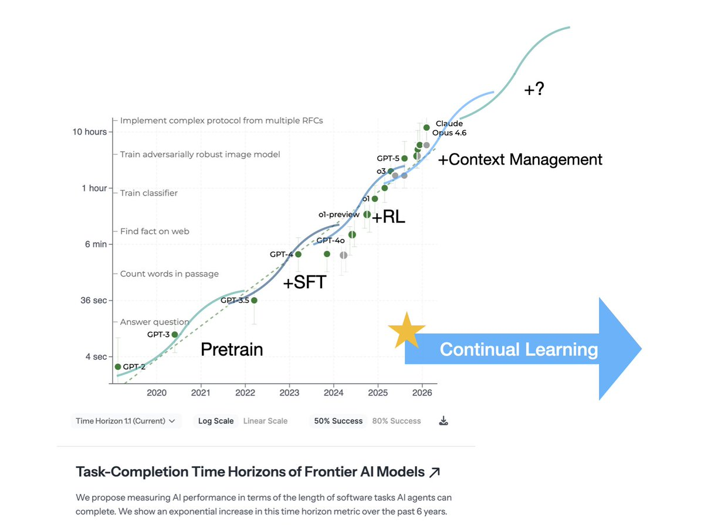
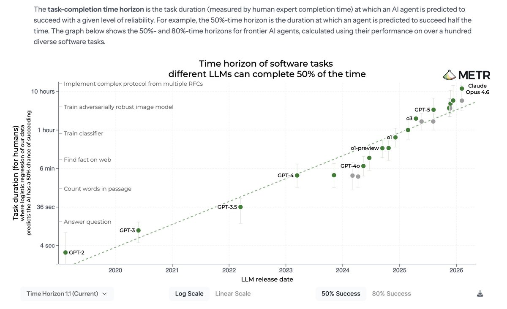
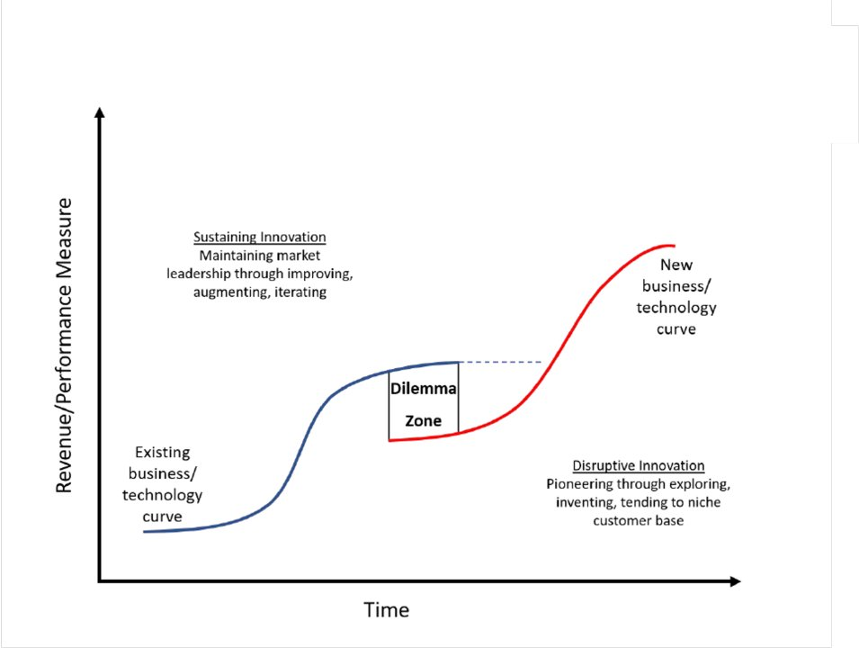

# Dario Says Continual Learning Is Solved. Is It?

- Source: https://x.com/tianle_cai/status/2042459055483207818
- Author: @tianle_cai
- Created: 2026-04-10T04:26:00Z

Dario Says Continual Learning Is Solved. Is It?

TLDR: I'd view continual learning more as an "arrow" than a "line" — it's the collective effort to push the task horizon that an LLM can reliably handle.
WTF is continual learning
I've been thinking

TLDR: I'd view continual learning more as an "arrow" than a "line" — it's the collective effort to push the task horizon that an LLM can reliably handle.

WTF is continual learning

I've been thinking about and working on "continual learning" for a few years (especially after realizing https://x.com/compose/articles/edit/1848072559721578496).

Yet this and several related concepts — continual learning, test-time training, self-evolving, lifelong learning — remain frustratingly vague, especially as they gain popularity. It doesn't help that in traditional ML, continual learning is mostly seen as synonymous with combating catastrophic forgetting...

After trying to explain what I actually work on to many friends, I gradually realized why people get confused. In this article, I'll offer my personal definition of continual learning and place it in a broader context.

The key reason for the confusion is that people think in terms of methods that each contribute a discrete piece to the system — pretraining, SFT, RL. But continual learning is better understood as a set of efforts unified by a directional goal: it's an arrow, not a point.

What's the arrow pointing to

To arrive at a definition, it helps to think backwards from what we actually want continual learning to achieve.

I really like the point of view from the task-completion horizon (from @METR_Evals) to track the progress of AI. We can treat the task horizon that an LLM can reliably handle as a north-star metric for model progress, analogous to transistor density in Moore's Law (though harder to measure).

From this perspective, all existing techniques -- pretrain, SFT, RL, agentic context management -- can be viewed as a way to keep pushing the horizon. As with the S-curves in *The Innovator's Dilemma*, new techniques may initially underperform existing ones but eventually surpass them — a pattern we've seen repeatedly, most recently in the wave of agentic coding progress led by @AnthropicAI .

Within this context, I'd like to view continual learning as:

"The set of efforts aimed at breaking past the feasible horizon of current techniques."

The intuition is simple: if a model cannot learn new things while performing a task, it will struggle when the task horizon grows very long.

Broadly speaking, when we only had pretraining, SFT was the "continual learning" — it enabled a base model to "learn" from a short context and answer relatively simple questions. And now that we have RL, agentic context management is the next "continual learning" — it lets a model compress, take notes, and extend its memory beyond the context window. That's also the reason @DarioAmodei thought continual learning had been solved in his interview. To some extent, yes — context management plus engineering improvements may well push the task horizon to weeks or even months. But the Riemann hypothesis hasn't been solved. Many very long-horizon tasks remain out of reach. So perhaps human-level continual learning is "solved", but the revolution is not yet complete — comrades still need to work hard.

Conclusion

To sum up, I'd advocate for a directional definition of continual learning and its related concepts. I hope this article makes things a bit clearer — so that we know what we talk about when we talk about continual learning.
