# Claude のManged Agentsに、土日で俺俺ハーネスを移植してみたら、法人向けにはこれだなって感じた話

- Source: https://x.com/minicoohei/status/2043391470376493515
- Author: @minicoohei
- Created: 2026-04-12T18:11:05Z

Claude のManged Agentsに、土日で俺俺ハーネスを移植してみたら、法人向けにはこれだなって感じた話

GitHub Actions + Lightsail + Claude Code の非対話モード（claude -p）で動かしていた AI エージェント群を、Anthropic の Managed Agents API に土日をかけて移行してみた。

正直に言うと、移行前はかなりの「俺俺」ソリューションを積み上げていた。外部通信を制限する俺俺ネットワーク制御、API キーを安全に渡す俺俺 CredentialManager、ツール実行を監視する俺俺 EventHooksCheckTool、自律改善のための Loop 機構——全部自前で書いていた。

それが全部いらなくなった。

ネットワーク制限、Vault による秘密情報管理、Event Stream による全操作の監視——セルフホスト構成で苦労して実現していたセキュリティとオブザーバビリティが、API 一本で手に入る。頑張ってハーネスを作ってきたけれど、Managed Agents で立てるほうが圧倒的に楽だと感じた。

ただし、Agent をガンガン動かすとガンガンお金がかかる。これは悩ましいポイントで、実際に GTM（Go-To-Market）キャンペーンの一部は従来の GitHub Actions + 軽量スクリプト構成に戻してコストを抑えている（後述）。コストが許せるなら Managed Agents 一択だが、現実はそうもいかない。

一方で、これまで作ってきた 100 以上の Claude Code Skills はそのまま使えた。Managed Agents の Skills API に登録するだけで、各 Agent がドメイン知識として参照できる。ここは無駄にならなかった。

この記事は、Environment 作成から Agent 定義、Vault 設定、Slack/LINE Bot の接続、Langfuse による品質モニタリングまで、全フェーズの実装過程をコード付きで記録したビルドログだ。

Managed Agents

1. Managed Agents とは何か

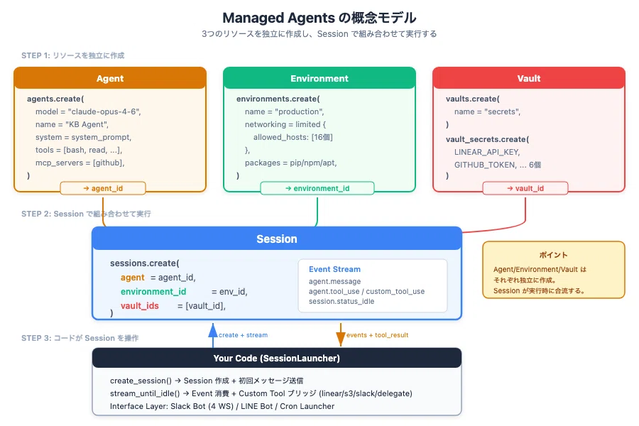

Managed Agents は Anthropic が提供する Agent 実行基盤（beta API）だ。従来の messages.create() が1回きりのリクエスト/レスポンスなのに対し、Managed Agents はステートフルなセッションの中で Agent が自律的にツールを使いながらタスクを完了する。

4つの中核概念がある。

Agent

モデル + system prompt + tools の束。これが「誰が何をできるか」の定義になる。

```
agent = client.beta.agents.create(     name="KB Agent",     model="claude-opus-4-6",     system=system_prompt,     tools=[         AGENT_TOOLSET,    # bash, read, write, web_fetch...        MCP_GITHUB,       # GitHub MCP サーバー        *LINEAR_TOOLS,    # Linear Custom Tools        *S3_TOOLS,        # S3 Custom Tools        *SLACK_TOOLS,     # Slack Custom Tools    ],     mcp_servers=[         {"type": "url", "name": "github", "url": "
https://api.githubcopilot.com/mcp/
"},     ], )
```

今回のシステムでは 8 つの Agent を定義した。

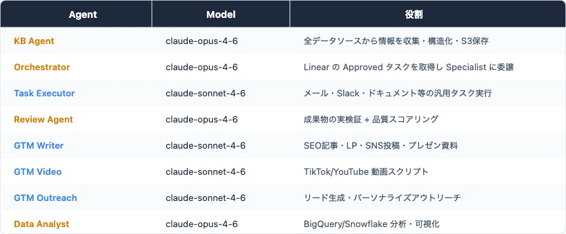

重要なのは、Agent の定義は再利用可能だということ。一度作れば、何度でもセッションを生成できる。

実際の Anthropic Console では、作成した Agent がこのように一覧表示される。

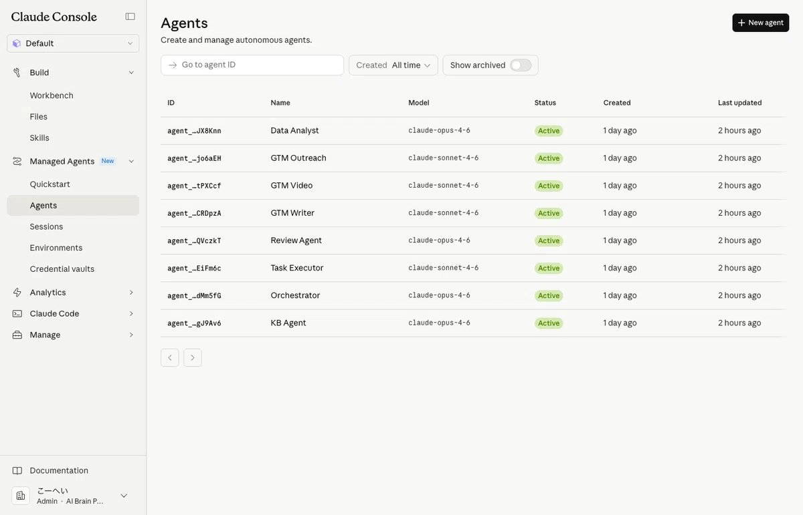

Session

ステートフルな会話単位。Agent に紐付けて作成し、メッセージを送信すると Agent が動き始める。全てのやりとりは Event Stream として流れてくる。

Environment

sandbox 実行環境。Agent がコードを実行する場所であり、ここでネットワーク制限とパッケージ制御を定義する。

```
env = client.beta.environments.create(
    name="production",
    config={
        "type": "cloud",
        "packages": {
            "pip": ["anthropic", "boto3", "slack-sdk", ...],
            "npm": ["@anthropic-ai/sdk"],
            "apt": ["ffmpeg"],
        },
        "networking": {
            "type": "limited",
            "allowed_hosts": [
                "api.linear.app",
                "slack.com",
                "s3.amazonaws.com",
                # ... 16 ドメインのみ許可
            ],
        },
    },
)

```

allowed_hosts に含まれないドメインへの通信はブロックされる。これだけで、Agent が意図しない外部サービスにデータを送信するリスクを排除できる。

Vault

秘密情報の安全な受け渡し。API キーやトークンを暗号化して保存し、Agent に安全に渡す仕組み。

```
vault = client.beta.vaults.create(display_name="managed-agents-secrets")
client.beta.vaults.credentials.create(
    vault_id=vault.id,
    display_name="GITHUB_TOKEN",
    auth={
        "type": "static_bearer",
        "token": os.environ["GITHUB_TOKEN"],
        "mcp_server_url": "https://api.github.com",
    },
)

```

従来の .env ファイルにベタ書きと違い、Vault 経由なら Agent から直接トークン値を見ることはできない。MCP サーバーの認証に自動で使われるだけだ。

2. Before → After: GitHub Actions + Lightsail vs Managed Agents

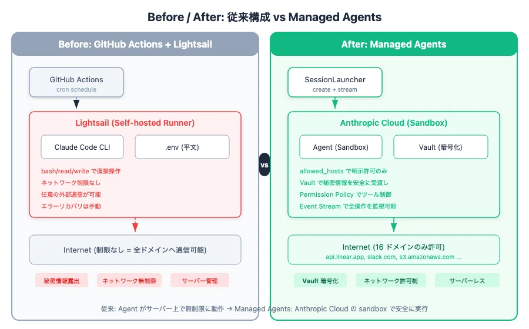

Before: GitHub Actions + Lightsail + 俺俺ハーネス

従来のアーキテクチャはこうだった。

GitHub Actions (cron) → Lightsail (self-hosted runner) → Claude Code CLI (claude -p) が bash/read/write で直接サーバー操作 → .env がサーバー上に平文で存在 → ネットワーク制限なし → エラーリカバリは手動

Claude Code CLI は非常に強力だが、何でもできてしまうのが問題だった。SSH で任意のコマンドを実行でき、.env ファイルを直接読める。ネットワーク制限もないので、理論上は任意の外部サービスにデータを送信できる状態だった。

だから「俺俺」ソリューションを積み上げた。

俺俺 外部通信制御: allowed_hosts リストを CLAUDE.md に書いて、Agent が通信していいドメインを制限。ただし Claude Code はこれを「お願い」として扱うだけで、技術的に強制はできない

俺俺 CredentialManager: .env の値を直接読ませず ${VAR} で間接参照させるルール。これも CLAUDE.md でのお願いベース

俺俺 EventHooksCheckTool: Claude Code の hook 機能でツール呼び出し前に安全性チェック。しかし hook の仕様変更で壊れることがあった

俺俺 Loop 機構: Agent が自律的に改善サイクルを回す仕組み。GitHub Actions の dispatch event でループを実現

どれも「やらないでね」というプロンプトベースの制約か、壊れやすいラッパーだった。機能はしていたが、安心感はなかった。

After: Managed Agents

SessionLauncher → Anthropic Cloud (sandbox) → Agent がsandbox 内で実行 → Vault で秘密情報を暗号化管理 → allowed_hosts で16ドメインのみ通信許可 → Event Stream で全操作をリアルタイム監視 → Permission Policy でツールごとにallow/ask制御

変わったのは主に3点。

1. ネットワーク制限

allowed_hosts で明示的に許可したドメインのみ通信可能。今回は 16 ドメインに絞った。

```
ALLOWED_HOSTS = [
    "api.anthropic.com",
    "api.linear.app",
    "slack.com",
    "api.slack.com",
    "s3.amazonaws.com",
    "s3.ap-northeast-1.amazonaws.com",
    "api.github.com",
    "api.datadoghq.com",
    "api.resend.com",
    "api.langfuse.com",
    "bigquery.googleapis.com",
    "api.line.me",
    "api.openai.com",
    "circleback.ai",
    "googleapis.com",
    "pikastream.org",
]

```

2. Vault による秘密情報管理

.env から Vault に移行。Agent は MCP サーバーの認証に Vault を使うが、トークン値そのものにはアクセスできない。

3. Event Stream による全操作の監視

Agent の全ツール呼び出し、全出力がリアルタイムで Event Stream に流れる。何をやっているか常に見える。

3. Agent の登録方法 — 3ステップで動かす

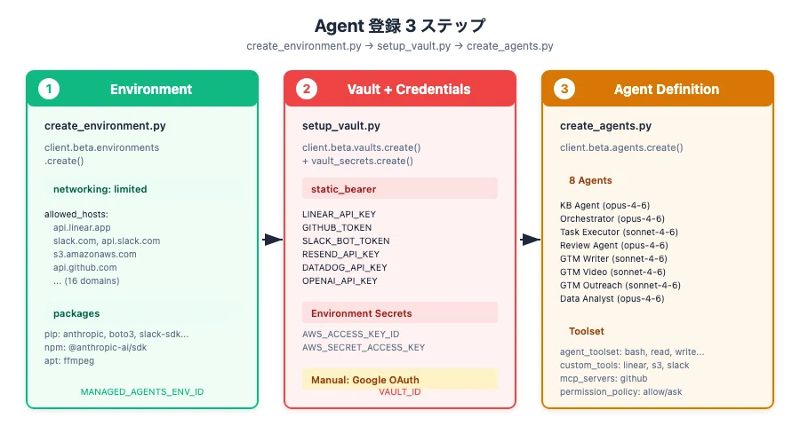

Step 1: Environment 作成

create_environment.py は冪等。

同名の Environment が存在すれば ID を返すだけ。

Console 上ではこう見える。

production Environment が Active で、Type は Cloud だ。

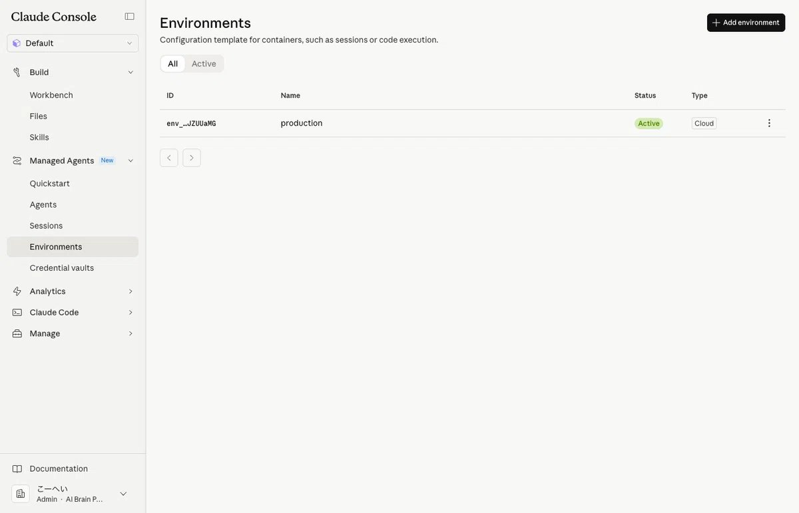

```
def create_or_get_environment():
    envs = client.beta.environments.list()
    for env in envs.data:
        if env.name == ENVIRONMENT_NAME:
            print(f"Environment already exists: {env.id}")
            return env

    env = client.beta.environments.create(
        name=ENVIRONMENT_NAME,
        config={
            "type": "cloud",
            "packages": PACKAGES,
            "networking": {
                "type": "limited",
                "allowed_hosts": ALLOWED_HOSTS,
                "allow_mcp_servers": True,
                "allow_package_managers": True,
            },
        },
    )
    return env

```

Step 2: Vault + Credential 設定

```
$ python scripts/setup/setup_vault.py --create
Created vault: vault_01JX...
  REGISTERED: LINEAR_API_KEY
  REGISTERED: GITHUB_TOKEN
  REGISTERED: SLACK_BOT_TOKEN
  REGISTERED: RESEND_API_KEY
  REGISTERED: DATADOG_API_KEY
  REGISTERED: OPENAI_API_KEY

--- AWS Environment Secrets ---
  [SET] AWS_ACCESS_KEY_ID: S3 knowledge-lake アクセス用
  [SET] AWS_SECRET_ACCESS_KEY: S3 knowledge-lake アクセス用

--- Manual setup required ---
  [ ] Google OAuth — Console > Vaults > Add OAuth credential
```

Credential の種類は 2つ。

static_bearer: API キー・トークン（Linear, GitHub, Slack, Resend, Datadog, OpenAI）

Environment Secrets: AWS credentials（boto3 が自動で読むため）

Google OAuth だけは Console から手動設定が必要。

Credential Vaults の画面。managed-agents-secrets に全 Credential が格納されている。

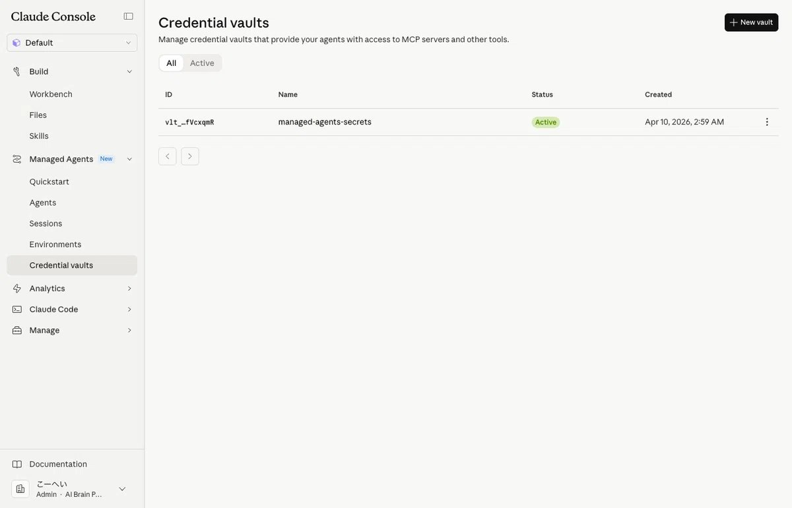

Step 3: Agent 定義

```
$ python scripts/setup/create_agents.py
=== DRY RUN (use --create to execute) ===

DRY-RUN: would create agent 'KB Agent' (model=claude-opus-4-6)
DRY-RUN: would create agent 'Orchestrator' (model=claude-opus-4-6)
DRY-RUN: would create agent 'Task Executor' (model=claude-sonnet-4-6)
DRY-RUN: would create agent 'Review Agent' (model=claude-opus-4-6)
DRY-RUN: would create agent 'GTM Writer' (model=claude-sonnet-4-6)
DRY-RUN: would create agent 'GTM Video' (model=claude-sonnet-4-6)
DRY-RUN: would create agent 'GTM Outreach' (model=claude-sonnet-4-6)
DRY-RUN: would create agent 'Data Analyst' (model=claude-opus-4-6)

$ python scripts/setup/create_agents.py --create
Created: KB Agent → agent_01JX...
Created: Orchestrator → agent_01JX...
...
```

--create フラグなしでは dry-run。全 Agent が冪等に作成される（同名が存在すれば skip）。

各 Agent の tools 構成:

```
AGENT_TOOLSET = {
    "type": "agent_toolset_20260401",
    "configs": [
        {"name": "bash", "permission_policy": ALWAYS_ALLOW},
        {"name": "read", "permission_policy": ALWAYS_ALLOW},
        {"name": "write", "permission_policy": ALWAYS_ALLOW},
        {"name": "edit", "permission_policy": ALWAYS_ALLOW},
        {"name": "web_fetch", "permission_policy": ALWAYS_ALLOW},
        {"name": "web_search", "permission_policy": ALWAYS_ALLOW},
    ],
}
```

permission_policy で各ツールの許可レベルを制御。always_allow は自動承認、always_ask はオペレーター確認が必要。GitHub の create_issue や create_pull_request は always_ask にしてある。

4. Custom Tool の設計

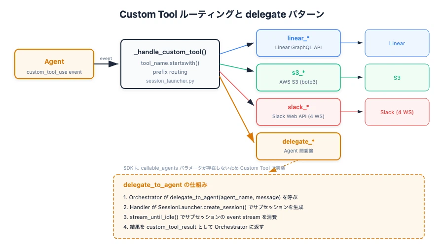

Managed Agents には組み込みツール（bash, read, write 等）があるが、Linear や S3 など外部サービスとの連携には Custom Tool が必要になる

4種類の Custom Tool

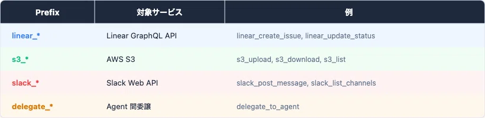

ルーティングパターン

Agent が Custom Tool を呼ぶと agent.custom_tool_use イベントが発火する。SessionLauncher がこれを受け取り、tool_name の prefix でハンドラに振り分ける。

```
@staticmethod
def _handle_custom_tool(tool_name: str, tool_input: dict) -> str:
    if tool_name.startswith("linear_"):
        return handle_linear(tool_name, tool_input)
    elif tool_name.startswith("s3_"):
        return handle_s3(tool_name, tool_input)
    elif tool_name.startswith("slack_"):
        return handle_slack(tool_name, tool_input)
    elif tool_name.startswith("delegate_"):
        return handle_delegate(tool_name, tool_input)
    else:
        return json.dumps({"error": f"Unknown custom tool: {tool_name}"})
```

delegate_to_agent — Agent 間委譲

これが最も重要な Custom Tool だ。SDK には callable_agents パラメータが存在しないため、Agent 間の委譲は Custom Tool で自前実装する必要がある。

仕組みはシンプル。

Orchestrator が delegate_to_agent({agent_name: "Task Executor", message: "..."}) を呼ぶ

ハンドラが SessionLauncher.create_session() でサブセッションを生成

stream_until_idle() でサブセッションの Event Stream を全消費

結果テキストを custom_tool_result として Orchestrator に返す

Orchestrator から見ると、あたかも普通のツール呼び出しのように見える。実際には裏でサブセッション全体が動いている。

以下がその具体的な処理フローだ。

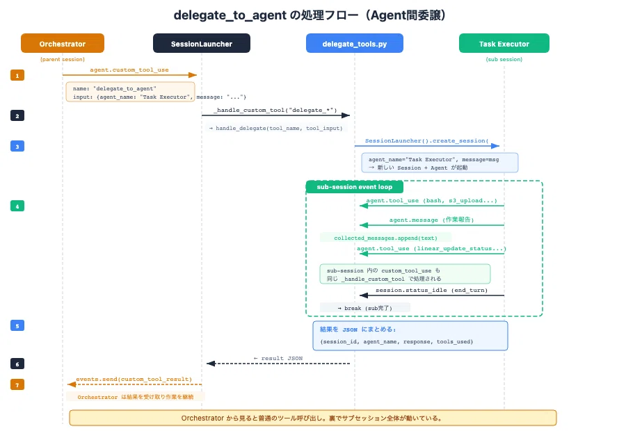

5. セッション管理と Event Stream

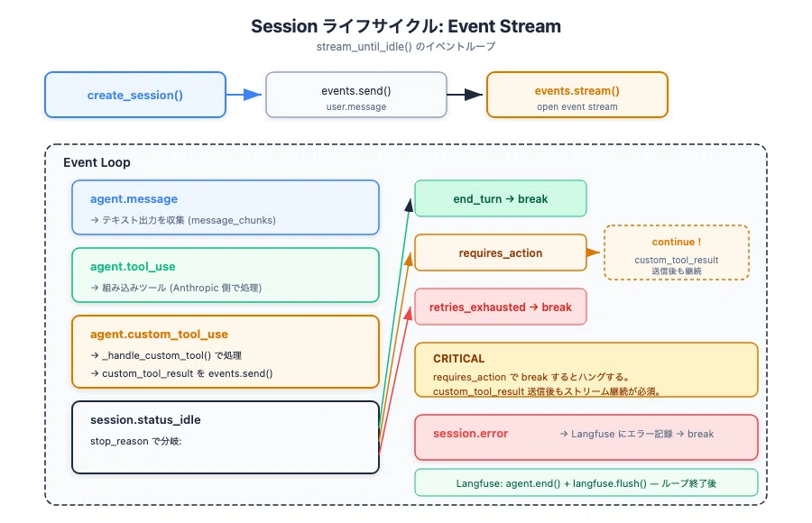

以下が SessionLauncher の実際のシーケンスだ。create_session() でセッションを作り、stream_until_idle() で Event を消費しながら Custom Tool をブリッジする全体像がわかる。

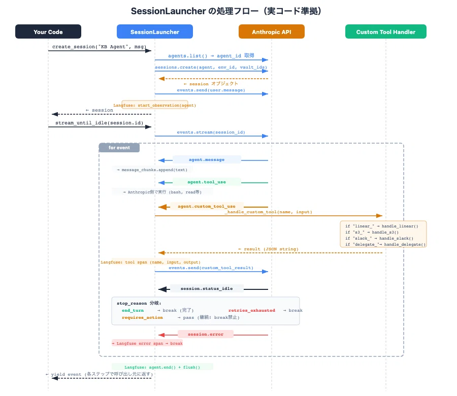

SessionLauncher がこのシステムの心臓部だ。セッション作成 → イベント購読 → Custom Tool ブリッジを一手に引き受ける。

Console の Sessions 画面では、全セッションの履歴が一覧表示される。どの Agent がいつ実行され、何分で完了したかが一目でわかる。

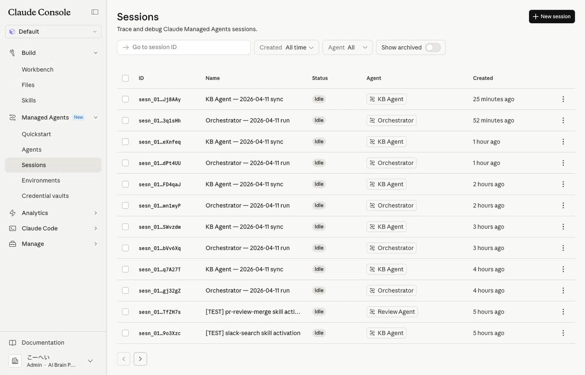

stream_until_idle() のイベントループ

copy

```
def stream_until_idle(self, session_id: str):
    with client.beta.sessions.events.stream(session_id) as stream:
        for event in stream:
            yield event

            if event.type == "agent.custom_tool_use":
                # 自前ハンドラで処理 → 結果を返送
                result = self._handle_custom_tool(event.name, event.input)
                client.beta.sessions.events.send(
                    session_id,
                    events=[{
                        "type": "user.custom_tool_result",
                        "custom_tool_use_id": event.id,
                        "content": [{"type": "text", "text": result}],
                    }],
                )

            elif event.type == "session.status_idle":
                stop_reason = event.stop_reason.type
                if stop_reason in ("end_turn", "retries_exhausted"):
                    break
                elif stop_reason == "requires_action":
                    pass  # 継続 ← ここが重要

```

stop_reason の分岐が最も重要なポイント。

end_turn: Agent がタスク完了と判断。break。

requires_action: Custom Tool の結果待ち。break してはいけない。custom_tool_result 送信後もストリームを継続する。

retries_exhausted: リトライ上限到達。break。

requires_action で break すると Agent がハングする。これは実際にハマったバグだ。

6. 品質管理 — Review Agent と Outcome Rubrics

Agent の出力は必ずしも正しくない。「ファイルを S3 にアップロードした」と言っても、実際にはアップロードが失敗している可能性がある。

S3 実検証

Review Agent は「成果物を作った」という Agent の自己申告を信用しない。実際に S3 からダウンロードして中身を確認する。

Outcome Rubrics

5段階スコアリングで品質を定量評価する。

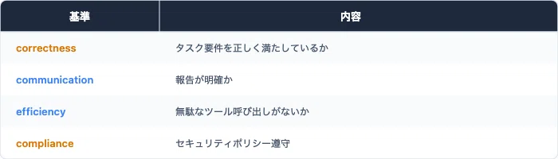

pass_threshold: 3.5（平均以上で合格）

hard_fail: correctness または compliance が 2 以下で即不合格

7. Observability — Datadog + Langfuse

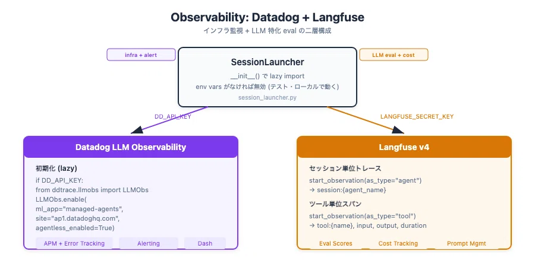

なぜ 2つ必要か。Datadog はインフラ監視 + アラート、Langfuse は LLM 特化の eval + コスト追跡。役割が違う。

Datadog LLM Observability

```
# SessionLauncher.__init__()
dd_api_key = os.environ.get("DD_API_KEY")
if dd_api_key:
    try:
        # APM/ASM 無効化: localhost:8126 への接続エラーを防止
        os.environ.setdefault("DD_TRACE_ENABLED", "false")
        os.environ.setdefault("DD_APPSEC_ENABLED", "false")
        from ddtrace.llmobs import LLMObs
        LLMObs.enable(
            ml_app="managed-agents",
            api_key=dd_api_key,
            site="ap1.datadoghq.com",
            agentless_enabled=True,
        )
    except ImportError:
        print("[Warning] ddtrace not installed, skipping", file=sys.stderr)
```

agentless_enabled=True で LLM Observability データを Datadog API に直送する。ただし ddtrace をインポートすると APM Tracer と AppSec パッチが自動で有効になり、ローカルの Datadog Agent (localhost:8126) への接続を試みてエラーログが大量に出る。DD_TRACE_ENABLED=false で APM を止め、LLM Obs だけを動かすのが正しい構成。

```
Langfuse v4
# セッション作成時
self._lf_agent = self._langfuse.start_observation(
    name=f"session:{agent_name}",
    as_type="agent",
    input=message,
    metadata={"agent_name": agent_name, "session_id": session.id},
)

# Custom Tool 実行時
tool_obs = self._lf_agent.start_observation(
    name=f"tool:{event.name}",
    as_type="tool",
    input=event.input,
    output=result[:500],
    metadata={"is_error": is_error, "duration_s": round(elapsed, 3)},
)
tool_obs.end()

# セッション完了時
self._lf_agent.update(output=output_text[:2000])
self._lf_agent.end()
self._langfuse.flush()
```

LLM-as-a-Judge 自動評価

Langfuse の LLM-as-a-Judge 機能で、Agent の出力品質を自動評価する Evaluator を 4つ設定した。

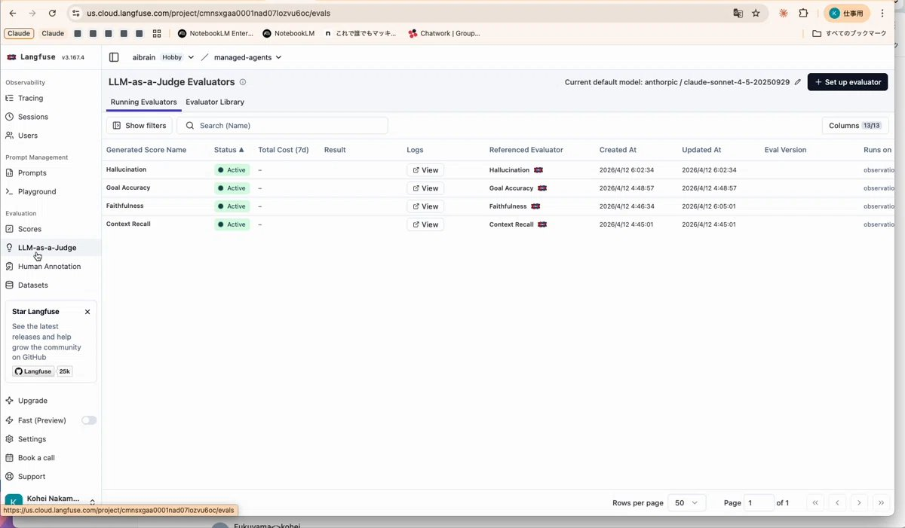

Hallucination: 出力に幻覚が含まれていないか

Goal Accuracy: タスクの目標を達成しているか

Faithfulness: 入力データに忠実か

Context Recall: 必要なコンテキストを参照しているか

すべて observation ベースの Evaluator で、claude-sonnet-4-5 がジャッジする。

Quality Scores ダッシュボード

ダッシュボードでスコアの推移と Tool 利用頻度を一覧できる。cron 実行のたびにデータが蓄積される。

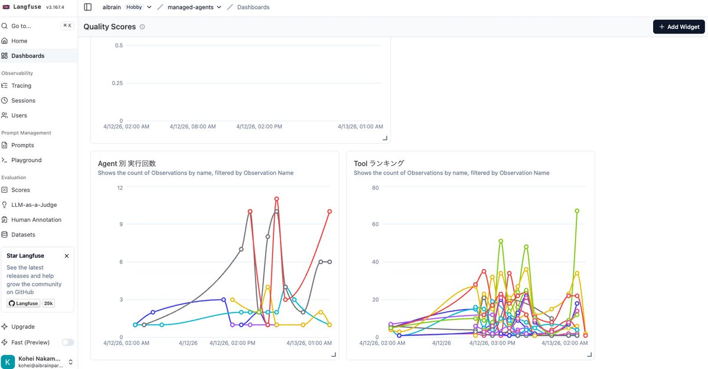

Review Agent スコアの自動送信

Langfuse にスコアを記録するため、delegate_tools.py で Review Agent の JSON 出力を自動パースして log_scores() を呼ぶ仕組みを入れた。

```
# delegate_tools.py — Review Agent 委譲後
if agent_name == "Review Agent":
    review_data = _extract_review_scores(response_text)
    if review_data and "scores" in review_data:
        launcher.log_scores(review_data["scores"], passed=review_data.get("passed"))
```

Orchestrator が Review Agent にタスクを委譲するたびに、correctness, communication, efficiency, rubric_passed が Langfuse に自動記録される。ダッシュボードで品質推移を追跡できる。

8. Interface Layer — リアルタイム対話

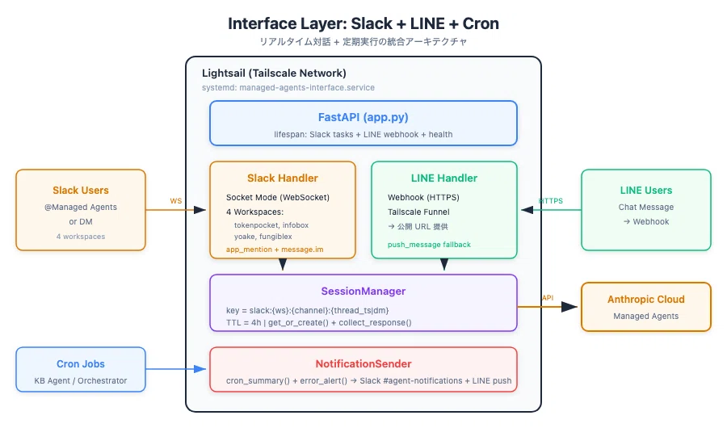

Agent と人間の接点は 4つ。

以下がSlackメッセージからAgent実行、スレッド返信までの全体フローだ。

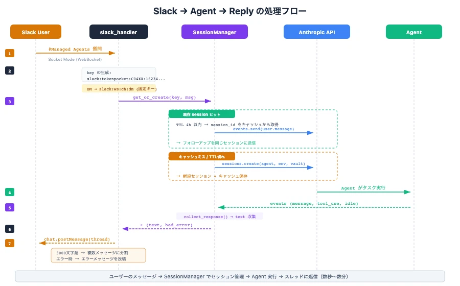

Slack Socket Mode

4つの Slack ワークスペース（tokenpocket, infobox, yoake, fungiblex）を同時に監視する。

```
SLACK_WORKSPACES = [
    SlackWorkspace(
        name="tokenpocket",
        bot_token_env="SLACK_BOT_TOKEN_TP",
        app_token_env="SLACK_APP_TOKEN_TP",
    ),
    # ... 3つ追加
]
```

なぜ Events API ではなく Socket Mode か？ Lightsail が Tailscale 内にあり公開 URL がないため、WebSocket 接続で Slack 側からのプッシュを受け取る。

app_mention（メンション）と message.im（DM）の両方をハンドルする。

LINE Bot

Tailscale Funnel で公開 HTTPS URL を提供し、LINE の Webhook を受ける。

Linear

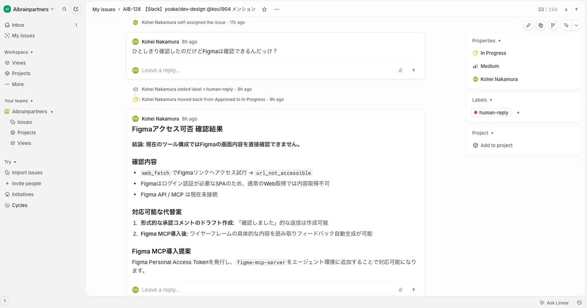

ISSUE管理をLienarにして、LinearにそのままコメントしたらAgentが処理をするようにした。

SessionManager

Slack/LINE からのメッセージを Managed Agent セッションに紐付けるインメモリキャッシュ。

```
class SessionManager:
    def get_or_create(self, key, message, agent_name, title):
        with self._lock:
            if key in self._sessions:
                session_id, last_used = self._sessions[key]
                if time.monotonic() - last_used < self._ttl:
                    # フォローアップメッセージを既存セッションに送信
                    _client.beta.sessions.events.send(
                        session_id,
                        events=[{
                            "type": "user.message",
                            "content": [{"type": "text", "text": message}],
                        }],
                    )
                    return session_id, False
        # 新規セッション作成
        session = self.launcher.create_session(...)
```

TTL は 4時間。同じスレッド内の連続メッセージは同じセッションに送られる。最初のバージョンではフォローアップメッセージが既存セッションに送信されないバグがあった（Codex レビューで発見）。events.send() の追加で修正。

Cron 通知

KB Agent と Orchestrator の定期実行後、NotificationSender が Slack（#agent-notifications）と LINE に結果を通知する。

```
# cron_kb.py
notifier.send_cron_summary(
    agent_name="KB Agent",
    session_id=session.id,
    duration_seconds=time.monotonic() - t0,
    error_count=exit_code,
    summary_text="".join(output_chunks)[:500],
)
```

9. Skills 統合 — 旧リポから37スキルを移行

Phase E で、旧リポジトリ（githubactions_fordata）の 104 スキルを精査し、37 の Custom Skill として Managed Agents に移行した。

Skills とは

Managed Agents の Skills は、Agent にドメイン知識を与える仕組みだ。Tools が「何ができるか」なら、Skills は「どうやるか」のノウハウに相当する。各スキルは SKILL.md（マークダウン）で記述し、API でアップロードして Agent に紐付ける。

104 → 37 への精査

旧リポには 104 のスキルがあったが、重複・廃止・Managed Agents 非互換を除外して 37 に絞った。

Agent 別のスキル配分

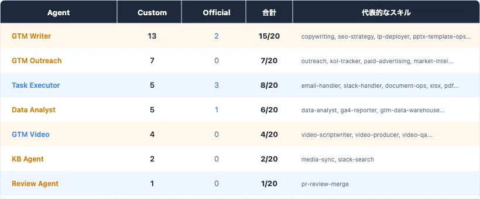

上限は Agent あたり 20 スキル。GTM Writer が 15/20 で最も多い。

migrate_skills.py — アップロードの仕組み

```
# dry-run で検証
$ python scripts/setup/migrate_skills.py
=== SKILL SUMMARY ===
Total custom skills: 37
Errors: 0
  article-publisher (234 lines)
  copywriting (124 lines)
  ...

=== AGENT ALLOCATION ===
  GTM Writer: 13 custom + 2 official = 15/20
  GTM Outreach: 7 custom + 0 official = 7/20
  Task Executor: 5 custom + 3 official = 8/20
  ...

# アップロード実行
$ python scripts/setup/migrate_skills.py --create
  UPLOAD copywriting ... → skill_01JX... (v1)
  UPLOAD seo-strategy ... → skill_01JX... (v1)
  ...
Registry saved: scripts/agents/skills/registry.json
```

アップロード後、create_agents.py --update で各 Agent にスキルを紐付ける。

```
# create_agents.py
from scripts.setup.migrate_skills import build_skills_list

skills = build_skills_list("GTM Writer")
# → [{"type": "custom", "skill_id": "skill_01JX...", "version": 1},
#    {"type": "anthropic", "skill_id": "pptx"},
#    {"type": "anthropic", "skill_id": "xlsx"}]

agent = client.beta.agents.update(
    agent_id,
    version=agent.version,
    skills=skills,
    ...
)
```

Custom Skills（自前の SKILL.md）と Official Skills（Anthropic 公式の pptx, xlsx, pdf 等）の2種類がある。

10. コスト最適化 — 全部を Agent にしない判断

Managed Agents は強力だが、使えば使うほどコストがかかる。Opus モデルで Agent を回すと 1 セッションあたり数ドル〜十数ドル。cron で毎日回せば月額はすぐに膨らむ。

実際に運用してみて、「全タスクを Managed Agents に載せるべきではない」という判断に至った。

GTM キャンペーンはスクリプトに戻した

GTM（Go-To-Market）キャンペーン——SEO 記事の生成、SNS 投稿、動画スクリプト作成、B2B アウトリーチ——は、当初 Managed Agents の GTM Writer / GTM Video / GTM Outreach に載せる予定だった。

だが実際には、GTM タスクの大半は「定型的な処理の繰り返し」だ。9 つの戦略レンズ（Content, Quality, Trends, Distribution, Campaigns, Analysis, Infrastructure, B2B Outreach, Development）に基づいて Issue を自動生成し、1 つずつ実行する。

これを Managed Agents で回すと:

1 Issue あたり Opus セッション 1 回 = 数ドル

1 日 5〜10 Issue = $15〜50/日

月額 = $450〜1,500

同じことを GitHub Actions + Claude Code CLI（claude -p）+ 軽量スクリプトでやると:

Claude Max プラン $200/月（定額）で回せる

scripts/gtm/ に 25 本の特化スクリプトを置いて、gtm-manager.yml（6 時間ごと）と gtm-patrol.yml（毎時）で実行

コスト可視化スクリプト（gtm_cost_tracker.sh）で API 等価コストを追跡

【コスト (API等価)】 今日: $45.23 / 7日間: $312.50 累計: $11,011.72 (ROI 55.1x) 定額プラン: $200/月

API 等価で月 $1,000 以上の処理を、定額 $200 で回せている計算。ROI 55 倍。

判断基準: Managed Agents vs スクリプト

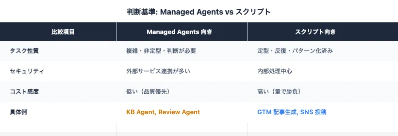

結果として、8 Agent のうち実際に cron で毎日動かしているのは KB Agent と Orchestrator の 2 つ。残りは Slack/LINE からのオンデマンド実行か、Orchestrator からの委譲時のみ動く。GTM 系タスクは引き続き GitHub Actions + スクリプト構成で、コストを月 $200 に抑えている。

Lightsail の self-hosted runner を残した理由

Managed Agents に移行したのに、なぜ GitHub Actions + Lightsail を完全に捨てなかったのか。

理由は Vault が MCP サーバーの認証にしか使えないからだ。

Vault に登録した Credential は MCP サーバー（GitHub 等）の認証に自動で使われる。しかし、それ以外の用途——たとえば Google Drive にファイルをアップロードする、YouTube に動画を投稿する、Slack の複数ワークスペースに投稿する——には Custom Tool 経由で自前のコードを動かす必要がある。Custom Tool のハンドラは Anthropic Cloud 内ではなく、こちら側のプロセスで動く。つまり結局、API キーや OAuth トークンを持ったサーバーが必要になる。

それなら、Claude Code CLI（claude -p）で直接サーバーを触れたほうが楽な場面も多い。ファイルシステムに直接アクセスできるし、gcloud、aws、ffmpeg も直接叩ける。Managed Agents の sandbox 内ではパッケージを allowed_packages に追加する必要があるし、ネットワーク制限で通信先も明示的に許可しないといけない。

だから現実的な構成はこうなった。

セキュリティ重要 + 複雑なタスク → Managed Agents（Vault + ネットワーク制限 + Event Stream）

定型タスク + 外部サービス直叩き → GitHub Actions + Lightsail + Claude Code CLI（コスト最適化 + 柔軟性）

全部を Managed Agents に載せるのが理想だが、現時点では Custom Tool のハンドラをどこかで動かす必要がある以上、self-hosted runner は残しておくのが現実解じゃないかと思った。（セキュリティ的に鍵を触れない部分はIFで防がれてるのでかわらないので。）

Skills は両方で使える

ここが嬉しいポイントだった。Claude Code の Skills（.claude/skills/ に置いた SKILL.md）は、Managed Agents にも GitHub Actions にもそのまま使える。

Managed Agents: Skills API でアップロードして Agent に紐付け

GitHub Actions: Claude Code CLI が .claude/skills/ を自動で読み込み

100 以上のスキルを作ってきた投資が、どちらの構成でも活きる。移行で無駄になったものは「俺俺ハーネス」だけで、コンテンツ資産は全部残った。

12. まとめ -Managed Agentsすごい。

全フェーズの概要

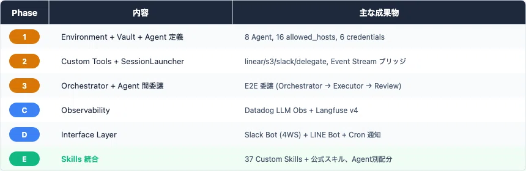

率直な所感

正直、頑張って俺俺ハーネスを作ってきたけど、Managed Agents で立てるほうが良いと感じた。コストが許せるのであれば。

俺俺外部通信制御、俺俺 CredentialManager、俺俺 EventHooksCheckTool——どれもプロンプトベースの「お願い」か、壊れやすいラッパーだった。

Managed Agents なら allowed_hosts で通信先を技術的に強制でき、Vault で秘密情報を暗号化管理でき、Event Stream で全操作がリアルタイムで見える。「お願い」から「強制」に変わる。これは大きい。

一方で、全部を Agent に載せるとコストが爆発する。GTM キャンペーンのように定型的なタスクは、GitHub Actions + 軽量スクリプト + Claude Max 定額プランで回すほうが圧倒的にコスパが良い。使い分けが重要だ。

これまで作ってきた 100 以上の Claude Code Skills はそのまま使えた。Managed Agents にも GitHub Actions にも登録できる。コンテンツ資産は無駄にならなかった。移行で捨てたのは「俺俺ハーネス」だけだ。

Managed Agents API の良い点

ネットワーク制限と Vault だけでセキュリティが劇的に改善

Event Stream で Agent の全操作がリアルタイムで見える

Environment のパッケージ管理でサーバーのセットアップ不要

冪等な API 設計（同名リソースの作成は skip）

Skills API で既存のナレッジ資産をそのまま移行可能

改善希望

callable_agents パラメータがほしい（Agent 間委譲を公式サポート）

複数アカウント触れるMCPが欲しい（GoogleもSlackもNotionも）

Vault の OAuth フローがもう少し簡単になるとありがたい

Langfuse でモニタリング体制を整えるべし

Managed Agents のコスト管理には Observability が不可欠だ。Langfuse で全セッションのトレース、ツール呼び出し、Review Agent のスコアを自動記録している。LLM-as-a-Judge で品質を定量評価し、コスト対効果を常に追跡できる体制にした。「Agent をガンガン動かしてガンガンお金がかかる」状態を、データで制御する。

使い分けの結論

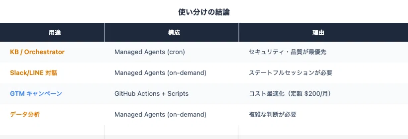
