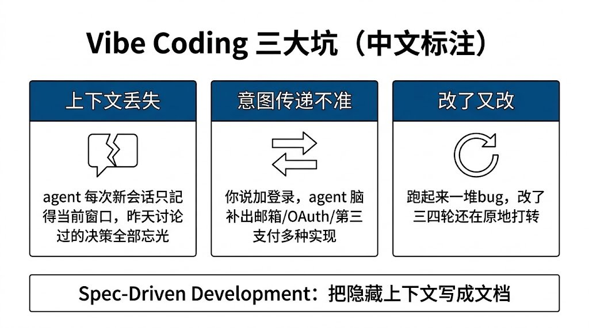
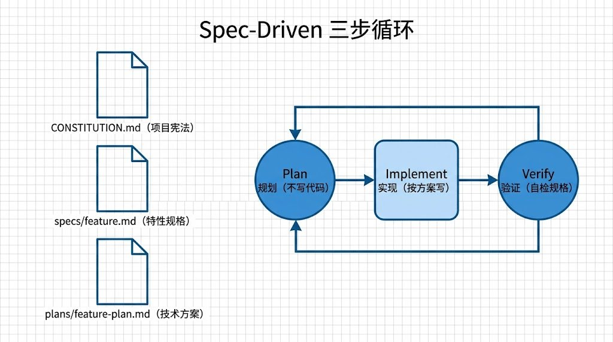
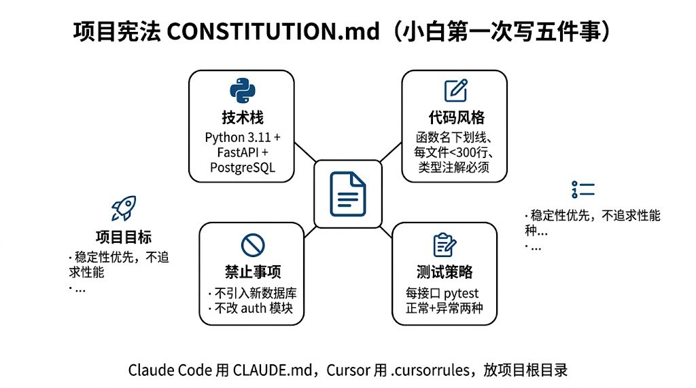
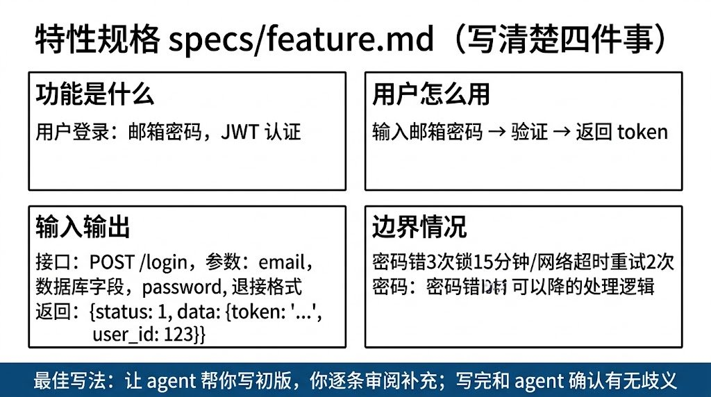
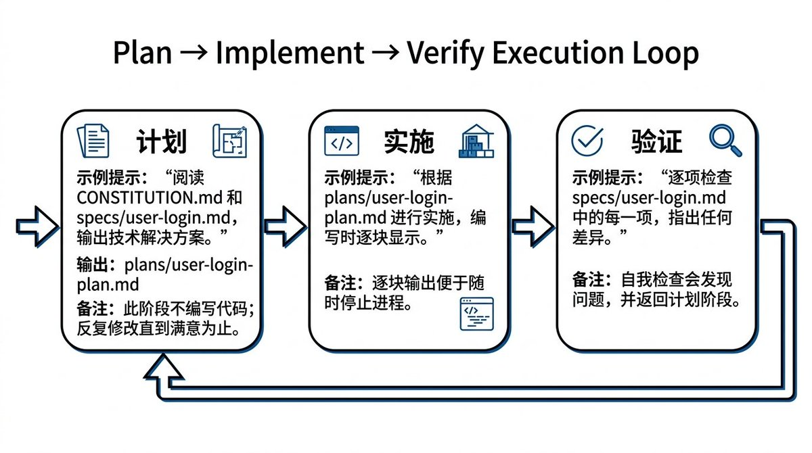
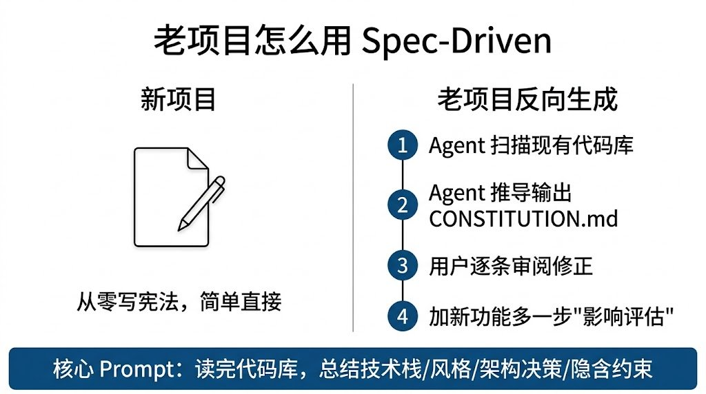
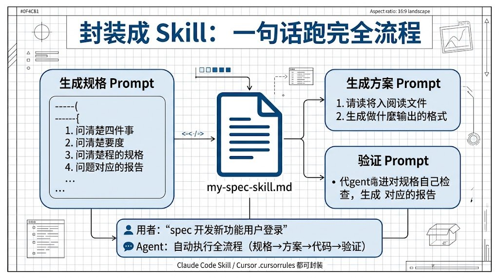

# Vibe Coding 为什么会失控？DeepLearning.AI 新课用 3 份文档把 AI 编程变可控

- Source: https://x.com/GoSailGlobal/status/2045320335399281017
- Author: @GoSailGlobal
- Created: 2026-04-18T01:55:42Z

Vibe Coding 为什么会失控？DeepLearning.AI 新课用 3 份文档把 AI 编程变可控

用 AI 写代码的人都遇到过这种情况：让 Claude 或 Cursor 写个功能，跑起来一试一堆 bug，回去改了又出新问题，改了三四轮还在原地打转。DeepLearning.AI 最新推出的免费课程《Spec-Driven Development with

用 AI 写代码的人都遇到过这种情况：让 Claude 或 Cursor 写个功能，跑起来一试一堆 bug，回去改了又出新问题，改了三四轮还在原地打转。DeepLearning.AI 最新推出的免费课程《Spec-Driven Development with Coding Agents》给出了一套方法论：先写规格再写代码，把 agent 变成真正可控的工程师。小白也能上手，一步步跟着做就行。

Vibe Coding 为什么会失控

Vibe Coding 指的是凭感觉让 AI 写代码，想到什么说什么，prompt 写得随性，结果也看运气。这种做法在写玩具项目时还行，一旦项目变复杂，问题立刻暴露出来。

上下文丢失是最大的坑。agent 每次回话只记得当前对话窗口里的内容，昨天讨论过的设计决策、选过的技术栈、定过的命名规范，今天开新会话就忘得一干二净。你以为它懂你的项目，它其实每次都在从零猜。

意图传递不准是第二个坑。你说"加个登录功能"，agent 脑补出来的可能是邮箱密码登录，也可能是 OAuth，还可能带上第三方支付。想让它按你的想法走，必须每次把所有细节重复说一遍，口干舌燥还不一定说得全。

Spec-Driven Development 的核心思路就是把这些隐藏的上下文写成文档，让 agent 每次干活前先读一遍，对齐方向后再动手。

三步循环工作流

整个方法论的骨架是三个文档加三个步骤。三个文档是项目宪法（constitution）、特性规格（feature spec）、技术方案（plan）。三个步骤是 Plan、Implement、Verify。

Plan 阶段让 agent 读宪法和特性规格，输出一份详细的技术方案。这一步不写一行代码，纯粹讨论怎么做。你可以来回改这个方案，直到满意为止。

Implement 阶段让 agent 按照方案写代码。因为方案已经定好了，agent 不会自己发挥想象力，只需要把文字翻译成代码。

Verify 阶段让 agent 自己检查代码是否符合规格，跑测试、读自己写的代码、对照文档逐条核对。不符合的地方回到 Plan 阶段改方案重来。

这个循环的好处是每一步都有书面产出，agent 换会话也能接着干，项目再复杂也不丢失上下文。

第一步：写项目宪法

项目宪法是整个项目的最高指导文件，所有 agent 操作都要先读它。小白第一次写不用复杂，就写五件事。

技术栈是哪些，比如 Python 3.11 + FastAPI + PostgreSQL。代码风格偏好，比如函数名用下划线、每个文件不超过 300 行、所有函数必须有类型注解。项目目标是什么，比如"给独立开发者做的 SaaS 计费后台，优先稳定性不追求性能"。不能做的事，比如"禁止引入新的数据库、禁止改动 auth 模块未经确认"。测试策略，比如"每个接口必须有 pytest 测试，覆盖正常和异常两种情况"。

把这五项写进一个 markdown 文件，命名 CONSTITUTION.md 或者 AGENTS.md 放项目根目录。Claude Code 会自动加载 CLAUDE.md，Cursor 会加载 .cursorrules，工具不同文件名不同但作用一样。

宪法不需要完美，用起来发现缺什么就加什么，三个月下来自然就全了。

第二步：写特性规格

每新做一个功能都要先写规格，不写直接让 agent 动手就会踩 vibe coding 的坑。特性规格文件放在 specs/ 目录下，按功能命名，比如 specs/user-login.md。

规格要写清楚四件事。这个功能是做什么的，一句话说明白。用户怎么用，写用户故事或操作流程。输入输出是什么，接口参数、数据库字段、返回格式都列出来。边界情况怎么处理，比如密码错 3 次锁账号 15 分钟、网络超时重试 2 次。

写规格最有效的方法是让 agent 帮你写。给 agent 一句"我想加一个用户登录功能"，让它生成初版规格，你再逐条审阅补充。agent 会问出很多你没想到的问题，比如"要不要记住登录状态""多设备登录怎么处理""需要验证码吗"，回答这些问题的过程本身就是设计。

规格写完之后要和 agent 确认一遍：你读完这份规格，觉得有没有歧义或者缺失。agent 会列出它不确定的点，你逐一回复，规格就更严密了。

第三步：Plan-Implement-Verify

规格写完进入执行阶段。先让 agent 输出技术方案，prompt 大概是"读 CONSTITUTION.md 和 specs/user-login.md，输出实现方案，包括要改哪些文件、新建哪些模块、接口设计、数据库变更、测试计划"。

agent 输出的方案保存到 plans/user-login-plan.md。你审阅这份方案，有问题就让 agent 修改，直到方案完全符合你的预期。这一步非常重要，方案对了代码就对了一半。

方案定稿后让 agent 按方案写代码，prompt 是"按 plans/user-login-plan.md 实现功能，每写一个模块先展示给我看再继续"。让 agent 分块输出而不是一口气写完，方便你中途叫停。

代码写完进入验证阶段。让 agent 对照规格自检，prompt 是"逐条核对 specs/user-login.md 的每一项要求，说明代码是否满足，不满足的地方指出来"。agent 自检出来的问题你让它修，修完再核对一遍。

整个循环走完，测试也跑通了，这个功能才算交付。

老项目怎么用

新项目从零开始写宪法很轻松，老项目怎么办。Paul 在课程里给的方法是反向生成宪法。

让 agent 扫描现有代码库，prompt 是"读完整个代码库，总结出这个项目的技术栈、代码风格、架构决策、隐含的约束，输出一份 CONSTITUTION.md"。agent 会花点时间把项目看一遍，然后产出一份反向推导的宪法。

你拿到这份宪法之后不要直接用，要逐条审阅。agent 推导可能有偏差，有些是巧合不是规范，有些是历史遗留不是当前约定。审阅的过程能帮你把隐藏的团队共识显式化，以后新人上手或者 agent 干活都有据可依。

老项目加新功能走同样的 plan-implement-verify 循环，但要多一步"影响评估"。prompt 里加一句"分析这次改动会影响哪些现有模块，列出可能破坏的功能点"，避免改一处坏三处。

做成自己的 Skill

手动跑完整个流程熟练之后可以封装成 Claude Code Skill 或 Cursor 规则。把常用的 prompt 模板写进一个 skill 文件里，以后说一句"spec 开发新功能用户登录"就能自动执行全流程。

skill 文件里放三组 prompt。第一组是生成规格的 prompt 模板，包含"问清楚四件事"的结构化提示。第二组是生成方案的 prompt 模板，指定读哪些文件、输出什么格式。第三组是验证 prompt，让 agent 对照规格自检并生成报告。

课程里演示了一个完整的 skill 文件，下载下来稍微改改就能用。课程链接在 deeplearning.ai 搜 Spec-Driven Development 就能找到，免费报名。

原文链接：deeplearning.ai/short-courses/spec-driven-development-with-coding-agents
