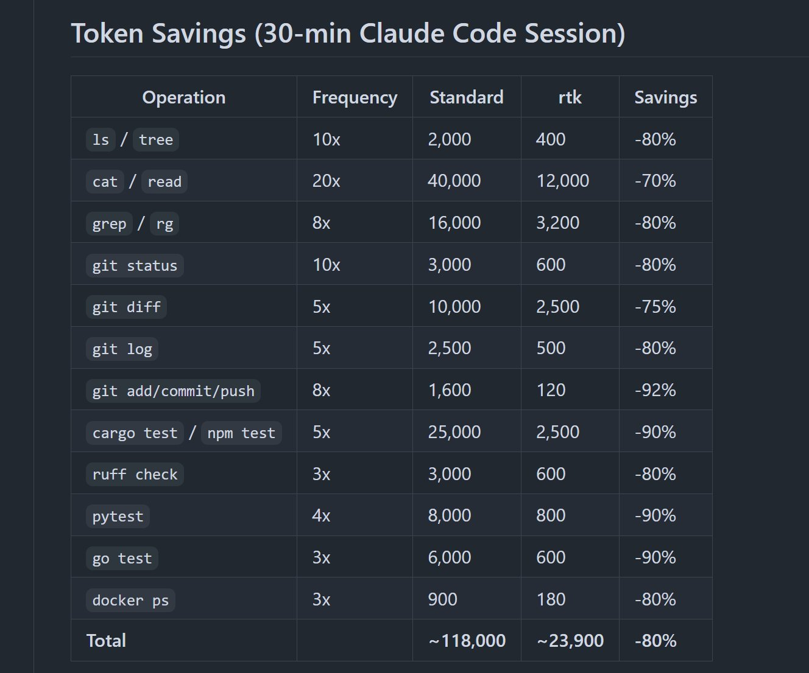

# 10 GitHub repos to spend 60-90% less tokens in Claude Code:

- Source: https://x.com/DeRonin_/status/2045420155434320270
- Author: @DeRonin_
- Created: 2026-04-18T08:32:21Z

10 GitHub repos to spend 60-90% less tokens in Claude Code:

1. RTK (Rust Token Killer)

CLI proxy that filters terminal output before it hits your context

- 60-90% reduction on common dev commands
- one binary, zero dependencies
- works with Claude Code, Cursor, Copilot

Repo: http://github.com/rtk-ai/rtk

2. Context Mode

Sandboxes raw tool output into SQLite instead of dumping it into context

- 98% context reduction on Playwright, GitHub, logs
- only clean summaries enter your conversation
- works as Claude Code plugin

Repo: http://github.com/mksglu/context-mode

3. code-review-graph

Local knowledge graph that maps your codebase with Tree-sitter

- Claude reads only what matters, not the entire repo
- 49x token reduction on large monorepos
- 6.8x on average reviews

Repo: http://github.com/tirth8205/code-review-graph

4. Token Savior

MCP server that navigates code by symbols, not full files

- 97% reduction on code navigation
- persistent memory across sessions
- 69 tools, zero external deps

Repo: http://github.com/Mibayy/token-savior

5. Caveman Claude

makes Claude talk like a caveman to cut output tokens

- 65-75% output reduction
- one-line install
- keeps full technical accuracy

Repo: http://github.com/JuliusBrussee/caveman

6. claude-token-efficient

one CLAUDE.md file that keeps responses terse

- drop-in, no code changes
- reduces output verbosity on heavy workflows
- best for output-heavy sessions

Repo: http://github.com/drona23/claude-token-efficient

7. token-optimizer-mcp

MCP server with caching, compression, and smart tool intelligence

- 95%+ token reduction through intelligent caching
- compresses repeated tool outputs

Repo: http://github.com/ooples/token-optimizer-mcp

8. claude-token-optimizer

reusable setup prompts for optimizing any project

- 90% token savings in 5 minutes
- reduces doc token usage from 11K to 1.3K

Repo: http://github.com/nadimtuhin/claude-token-optimizer

9. token-optimizer

finds ghost tokens that silently eat your context

- survives compaction without losing quality
- fixes context quality decay

Repo: http://github.com/alexgreensh/token-optimizer

10. claude-context (by Zilliz)

code search MCP that makes your entire codebase the context

- ~40% reduction with equivalent retrieval quality
- hybrid BM25 + dense vector search

Repo: http://github.com/zilliztech/claude-context

[ how to stack them ]:

you don't need all 10. pick 2-3 based on your workflow:

> heavy terminal output? RTK
> big codebase? code-review-graph + Token Savior
> lots of MCP servers? Context Mode
> quick fix? Caveman + claude-token-efficient

most people are burning tokens without knowing it

run /context in a fresh session and see how much is gone before you even type a word

your pocket will thank me later :<)

