# 机器人的终局：英伟达 Jim Fan 宣告 VLA 时代结束，WAM 登场

- Source: https://x.com/dotey/status/2053351712149135385
- Author: @dotey
- Created: 2026-05-10T05:49:32Z

机器人的终局：英伟达 Jim Fan 宣告 VLA 时代结束，WAM 登场

Jim Fan 是英伟达机器人与 AI 研究组（GEAR Lab）负责人，过去几年主推的 GR00T 人形机器人基础模型用的是 VLA（Vision-Language-Action，视觉 - 语言 - 动作）架构。他刚在 Sequoia AI Ascent 2026 上做了一场 20

Jim Fan 是英伟达机器人与 AI 研究组（GEAR Lab）负责人，过去几年主推的 GR00T 人形机器人基础模型用的是 VLA（Vision-Language-Action，视觉 - 语言 - 动作）架构。他刚在 Sequoia AI Ascent 2026 上做了一场 20 分钟的演讲，主题叫《Robotics' End Game》，第一件事就是宣布 VLA 路线过时——包括他自己半年前还在推的 GR00T。

取而代之的新范式叫世界动作模型（WAM），代表作是英伟达 2 月发布的 DreamZero。他把这套思路叫“底层同构”：复制 LLM（Large Language Model，大语言模型）走过的三步（预训练→对齐→强化学习），用视频世界模型替代语言模型，用人类第一人称视频替代遥操作数据，最终在 2040 年前让机器人自己设计和制造下一代自己。他对此有 95% 的把握。

演讲来源：Sequoia Capital AI Ascent 2026，2026 年 4 月 30 日发布。

原视频：https://www.youtube.com/watch?v=3Y8aq_ofEVs

要点速览

VLA 路线落幕：Jim 公开宣告 VLA 路线过时，新范式叫世界动作模型（WAM），代表作是 DreamZero（140 亿参数）。

告别遥操作数据：遥操作物理上限低，预测一两年内降到接近 0，被传感化人类数据取代。

神经缩放定律：EgoScale 用 21,000 小时人类第一人称视频预训练，团队发现了灵巧操作的神经缩放定律（R² = 0.998）。

神经仿真器：Dream Dojo 用 44,000 小时人类视频训练出一个完全绕过物理引擎的神经仿真器。

终局倒计时：给出 2040 年完成机器人终局的预测（物理自动研究），置信度 95%。

从 DGX-1 签名到“底层同构”

Jim 用一段往事开场。2016 年夏天，就在 OpenAI 当时的办公室，黄仁勋穿着标志性皮夹克，抱着一块大金属托盘走进来，上面写着：“致 Elon 和 OpenAI 团队，致计算和人类的未来。”那是全球第一台 DGX-1。

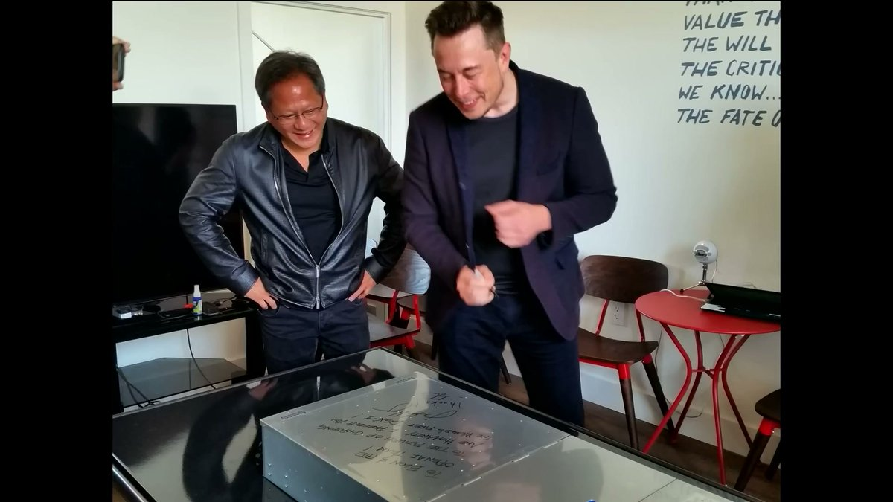

Jim 当时是 OpenAI 的第一个实习生，赶紧排队去上面签了名。“那时候我完全不知道自己在签什么。”旁边一起签的还有 Andrej Karpathy。这台机器现在在 Computer History Museum 收藏。Jim 补了一句，说自己感觉像恐龙一样老了。

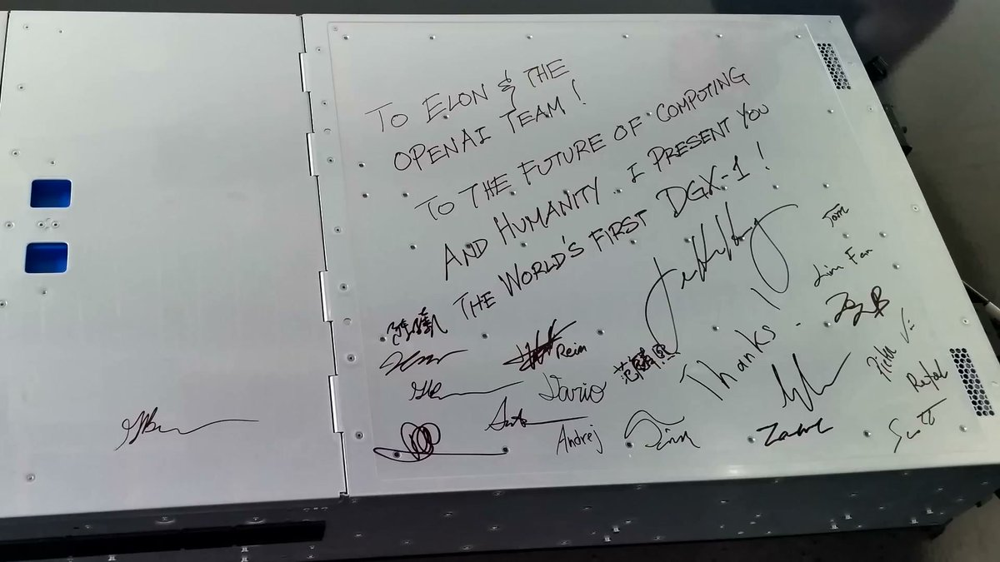

注：Jim Fan（范麟熙）是英伟达机器人与 AI 总监、杰出科学家，领导 GEAR Lab 和 GR00T 人形机器人项目。2016 年在 OpenAI 实习时的导师是 Ilya Sutskever 和 Andrej Karpathy，后在 Stanford 跟随 Fei-Fei Li 读完博士。

这个故事是为了引出他的核心框架。他引了 Ilya 那句“你信深度学习，深度学习就信你”，然后说 LLM 只用三次阶跃、六年时间就走到今天：GPT-3 的预训练，InstructGPT 的监督微调，o1 风格的强化学习，再到自动研究。

于是他做出了一个决定：抄作业，换个名字，叫**“底层同构”（the Great Parallel）**。把“模拟字符串的下一个状态”换成“模拟物理世界的下一个状态”，通过动作微调收敛到机器人需要的那部分，最后让强化学习走完最后一公里。

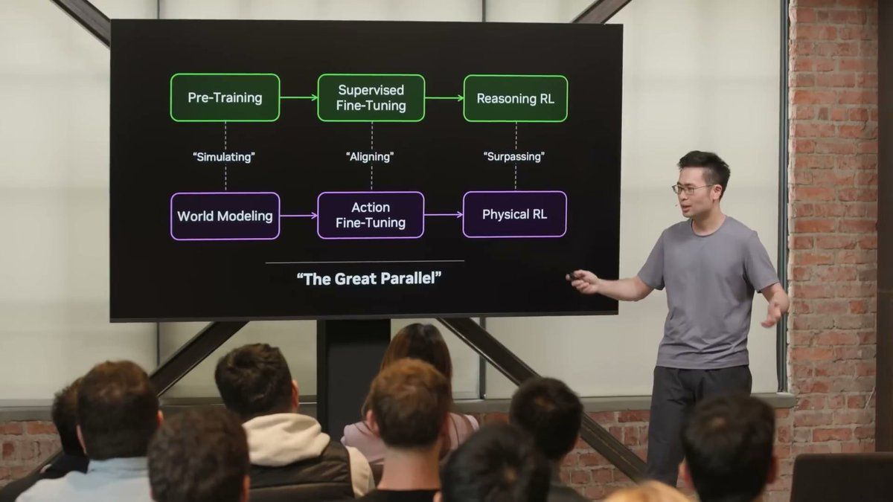

打不过就加入。 （“If you can't beat them, join them.”）

VLA 怎么了：参数都堆在了语言上

过去三年，机器人领域的主流架构是 VLA（Vision-Language-Action，视觉 - 语言 - 动作模型）。英伟达自家的 GR00T 和 Physical Intelligence 的 π0 都属于这个类别。

Jim 指出了结构性问题：其实这些模型该叫 LVA，因为参数大头全堆在语言上了。语言是一等公民，视觉次之，动作只能垫底。

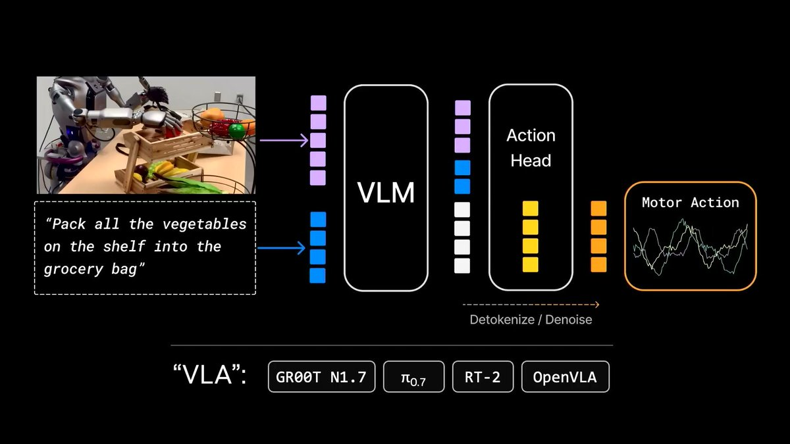

VLA 擅长编码知识和名词，不擅长物理和动词。重心放在了不对的地方。

他举了 RT-2 原始论文里那个经典 demo：让机器人把可乐罐推到 Taylor Swift 的照片旁边。模型没见过 Taylor Swift，但能泛化过去。问题是，泛化的是名词（能认出 Taylor Swift），而不是动词（该怎么推、找什么角度、用多大力）。

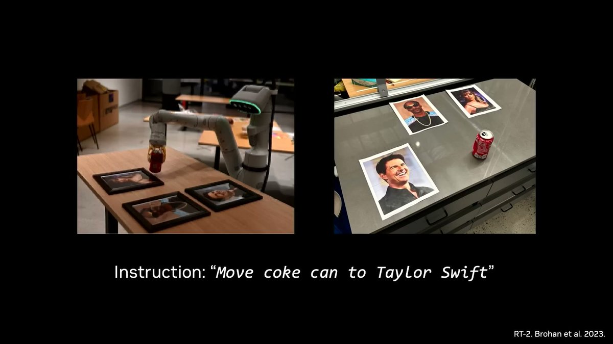

从 AI 垃圾视频到 DreamZero

VLA 不是答案，那下一个预训练范式是什么？结果发现是视频模型，它们在内部学会了模拟物理世界的下一个状态。

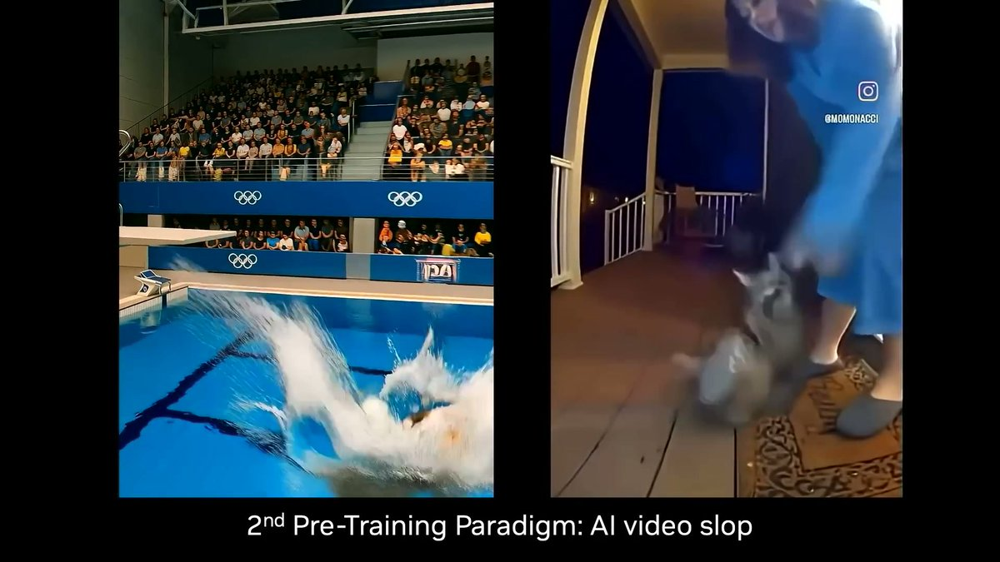

怎么把这些世界模型变有用？做动作微调。把“所有可能的未来”这种叠加态，收敛到一条对真实机器人有意义的动作轨迹上。

英伟达的答案叫 DreamZero。这是一种新型策略模型，在执行动作之前先往未来“做梦”几秒钟，然后根据梦境行动。DreamZero 同时解码下一帧画面和下一步动作。在这里，视觉和动作第一次真正成为了“一等公民”。

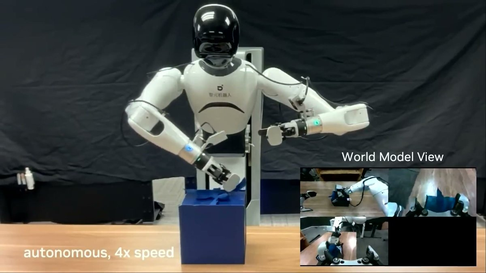

Jim 坦率地承认 DreamZero 目前做不到每个任务都 100% 可靠。“它大概相当于 GPT-2 的阶段，方向对了，但表现还不够稳定可靠。”他给这个新架构起名叫 WAM（World Action Models，世界动作模型）。

为我们亲爱的 VLA 默哀片刻。它已完成了历史使命。安息吧。世界动作模型万岁。

注：DreamZero 论文（arXiv 2602.15922）2026 年 2 月发布，140 亿参数，基于 Wan2.1 视频扩散模型。它有一个关键限制：14B 模型必须经过 38 倍系统级优化加 GB200 硬件，才能把闭环控制压到 7Hz，部署门槛极高。

数据革命：从遥操作到“机器人不用参与的数据采集”

过去三年是遥操作（teleop）的黄金时代。但遥操作有一个硬上限：每台机器人每天 24 小时。

“我说一天 24 小时，那是骗自己的。实际一天能干 3 小时就不错了，还得看当天的‘机器人之神’赏不赏脸——毕竟这帮机器天天闹脾气出毛病。”

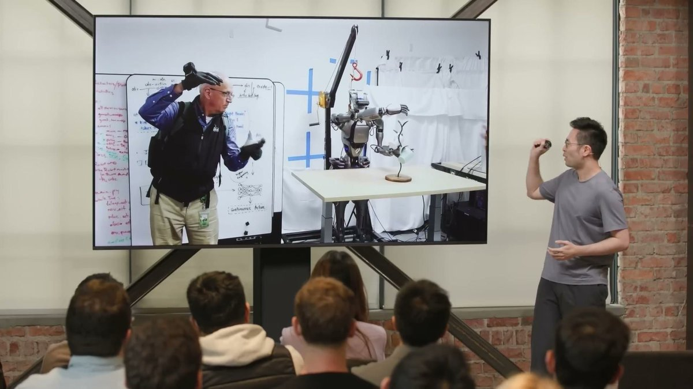

怎么破局？把机器人的末端执行器直接戴在人手上，直接采集数据，完全绕过机器人本体。

英伟达方案是 DexUMI，一种外骨骼装置。用外骨骼数据训练出的机器人策略可以完全自主运行，训练数据里没有任何遥操作数据。

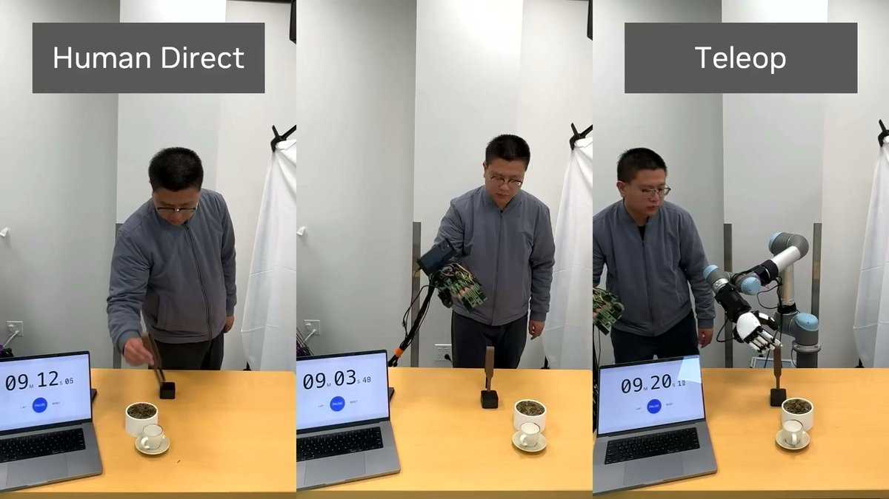

机器人很开心，因为它们终于不用参与数据采集了。

EgoScale：21,000 小时人类视频和缩放定律

英伟达推出了 EgoScale：99.9% 的训练数据来自人类第一人称视频（egocentric video）。

预训练用了 21,000 小时的野外人类数据，零机器人数据。动作微调阶段仅仅用了 50 小时的高精度动捕手套数据，外加 4 小时遥操作数据——加起来连训练总量的 0.1% 都不到。

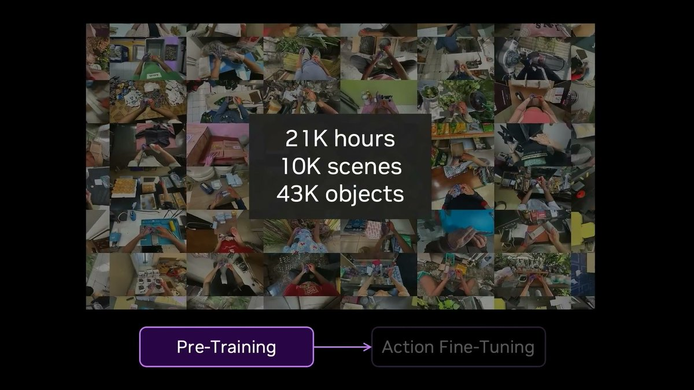

最重要的发现是：灵巧操作的神经缩放定律。预训练投入的算力小时数与最优验证损失之间，存在一条极其清晰的对数线性关系，R² 达到了惊人的 0.998。

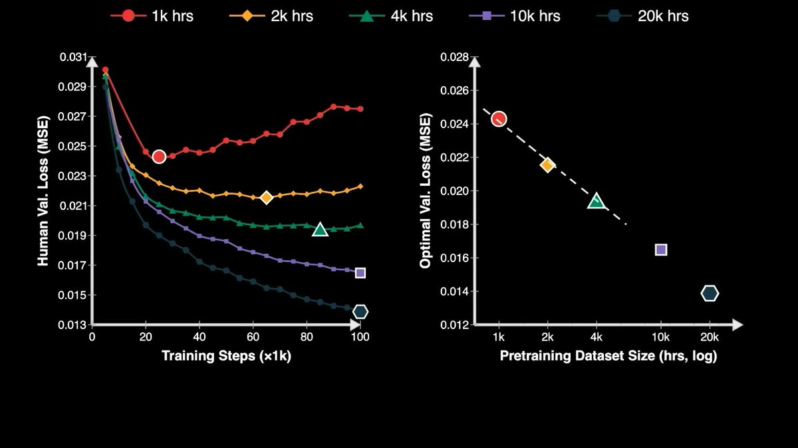

Jim 把所有数据策略的扩展性放在了一起：遥操作在最不可扩展的角落；第一人称视频如果能转动 FSD（Full Self-Driving，完全自动驾驶）式的数据飞轮，一年内能到 1000 万小时。

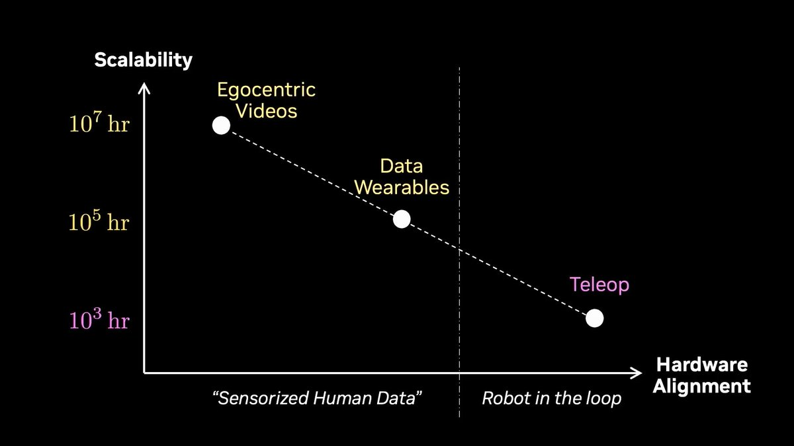

Dream Dojo：不用物理引擎的神经仿真器

机器人领域也需要花大钱买几百万个编程环境做强化学习（RL），但直接用真机（real-to-sim-to-real）不够。

进一步的方案是 Dream Dojo：不搞物理引擎那一套，直接把视频世界模型变成一个完整的神经仿真器。输入是连续动作信号，实时输出下一帧 RGB 画面和传感器状态。没有物理方程，没有图形引擎，完完全全是数据驱动的。

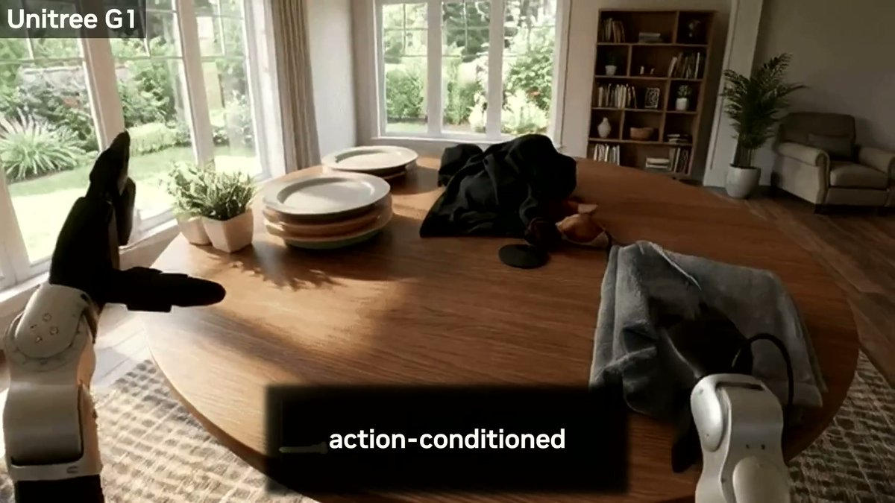

你看到的画面里没有一个像素是真实的。

“现在算力等于环境等于数据。或者用某位智者的话：买得越多，省得越多。这条消息已获得我老板批准。”

终局路线图：2040 年前的三个成就

Jim 把机器人的剩余路径类比成了必须解锁的三个科技树成就：

物理图灵测试：2-3 年内，你分不出执行任务的是人还是机器人。

物理 API：用软件和大模型编排机器人配置，建造“暗工厂”和自动化科学实验室。

物理自动研究：机器人开始自己设计、改进并制造出下一代机器人。

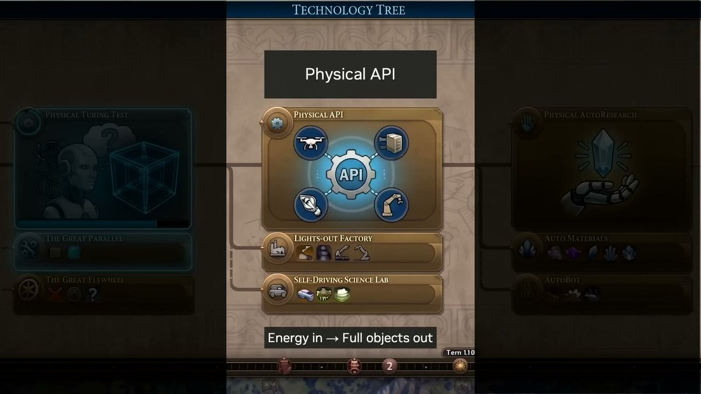

至于时间表，他类比 AI 从 AlexNet（2012）到智能体（2026）用了 14 年。再加 14 年，正好是 2040 年。

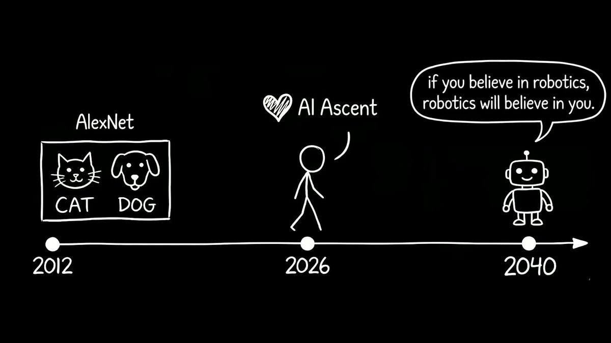

我们这一代人，生得太晚，没赶上大航海时代去探索地球；又生得太早，够不着星辰大海去探索宇宙。但我们生得刚刚好，赶上了攻克机器人难题的时代。

五个问题速答

Q：VLA 真的死了吗？ A：演讲层面是死了。但英伟达自家最新的 GR00T N1.7（2026 年 4 月）论文里还明确写“VLA 模型”。范式迁移在内部尚未完成。

Q：DreamZero 现在能用在生产环境吗？ A：不能。Jim 自己说它“大概是 GPT-2 阶段”。论文披露 14B 模型跑闭环控制只有 7Hz，且必须用 GB200。

Q：遥操作真的会被淘汰吗？ A：Jim 预测一两年内降到接近 0。但戴设备做家务不像开车是刚需，且行业大量已有的遥操作基础设施不会一夜间报废。

Q：灵巧操作的缩放定律意味着什么？ A：如果 R² = 0.998 持续成立，意味着增加人类视频数据，机器人灵巧性就会可预测地提升。这是整场演讲中最核心的实证论据。

Q：英伟达在这盘棋里赚什么？ A：WAM 和神经仿真器对算力需求极高。Jim 的那句“buy more, save more”直接反映了范式切换天然有助于卖芯片的商业意图。

最后：值得追踪的三个悬念

三件事最值得追踪：

DreamZero 如何跨越“GPT-2 阶段”：未来 12-18 个月能不能把极限参数做稳，决定了这套范式的真实威力。

英伟达内部对 VLA 范式的切换时刻：观察其产品更新中架构实质演进。如果下一代还是 VLA，则演讲更偏向概念营销。

第一人称视频数据的飞轮载体：英伟达自身没有消费级硬件入口，需观望谁（如苹果、Meta）能真正转动这块千万小时量级的数据。
