# Saved x bookmark 2092014354946257338

我的 AI 开发流程 之前有网友问我我的 AI 开发流程是什么，正好我前几天用 AI 实现了一个小功能，值得拿出来作为案例展示一下，也可以作为一个参考。

## Source details

- Source: https://x.com/dotey/status/2092014354946257338
- Author: @dotey
- Created: 2026-08-24T22:21:04Z

## Captured content

我的 AI 开发流程

之前有网友问我我的 AI 开发流程是什么，正好我前几天用 AI 实现了一个小功能，值得拿出来作为案例展示一下，也可以作为一个参考。
 
这个功能起源是有网友在 GitHub 的 Issues

之前有网友问我我的 AI 开发流程是什么，正好我前几天用 AI 实现了一个小功能，值得拿出来作为案例展示一下，也可以作为一个参考。

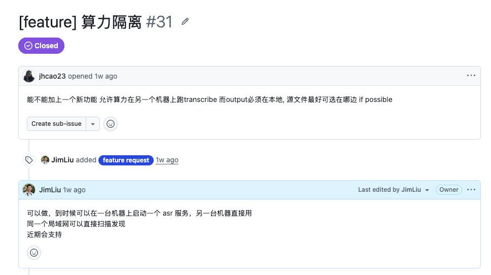

这个功能起源是有网友在 GitHub 的 Issues 给我留言（图1），问能不能给我写的字幕转录翻译 App BaoCut 加上远程转录功能。 也就是说我有两台电脑，一台是有英伟达显卡的高性能电脑 A，另一台只是日常办公的电脑 B，我想借助电脑 A 的算力，但日常一般只在电脑 B 上使用，我在电脑 B 使用 BaoCut 去转录的时候，把消耗算力转录的工作让电脑 A 完成。 我一看就觉得这是挺好的需求，但我没做过这个工作，也不知道是不是可行。 所以我的第一步不是马上去写代码，而是先做可行性分析。 一、可行性分析 没有做可行性就盲目动手我吃的亏可太多了，经常白忙活。另外就算做了可行性分析，有时候也可能做出错误判断，比如我前几天还做了一个本地文本模型帮助拆分对齐的，做可行性分析的时候觉得没问题，做完了实际体验才发现效果很糟糕，最后还是砍掉了，浪费了几天时间加很多 token，还好只是 token。 可行性分析通常有两个层面： 一个是从产品角度，这个功能是不是有价值，是不是和 App 的定位符合 一个是从技术角度，看这个功能技术上是否可行，成本是否可控 这里我从产品角度觉得这个功能对用户是有价值的，也和产品定位符合，所以我只是聚焦在技术可行性分析上。

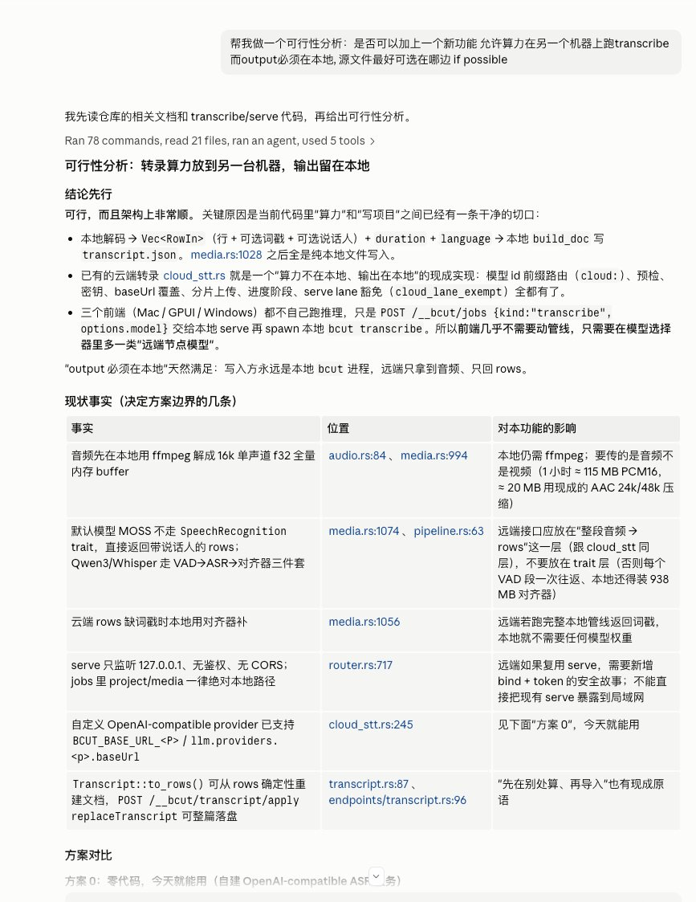

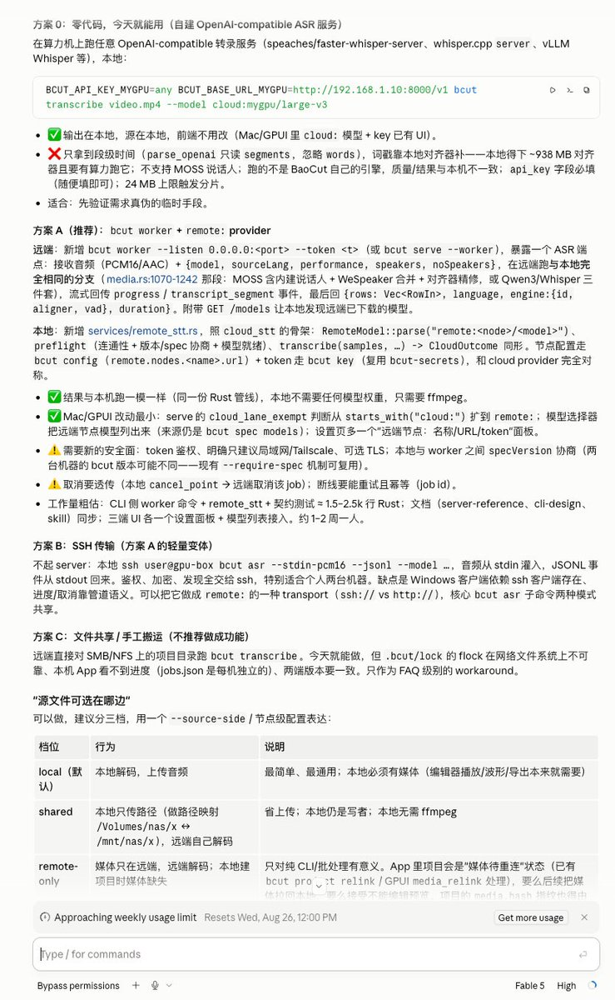

所以去 Claude Code 里面把原始需求发给，让它结合项目现状做一个可行性分析（图2），它在分析后给出了判断，觉得可行，并给出了若干方案（图3）。 这些方案可能要有一点技术背景更好理解，我看完后很快有了自己的判断： 方案0 和方案 C 虽然不需要修改代码，但是对用户来说太不友好，需要自己去想办法搭建一个 asr 服务器 方案 A 看起来不错，只要安装了 App 就能启动自己的转录服务 方案 B 对 Windows 不友好 所以我决定按照方案 A 推进，另外方案 0 虽然不靠谱但是其中提供一个 http 的转录 API 也是个不错的附加功能，可以捎带着加上。 二、写设计文档 在确定可行，并且捎带着确定了初步的技术方案，我也没有马上开始动手写代码，而是先去写设计文档。 这里的设计文档，更像是产品设计文档和技术设计方案的混合体，大概就是描述清楚需求、架构设计、UI 设计文档的混合。

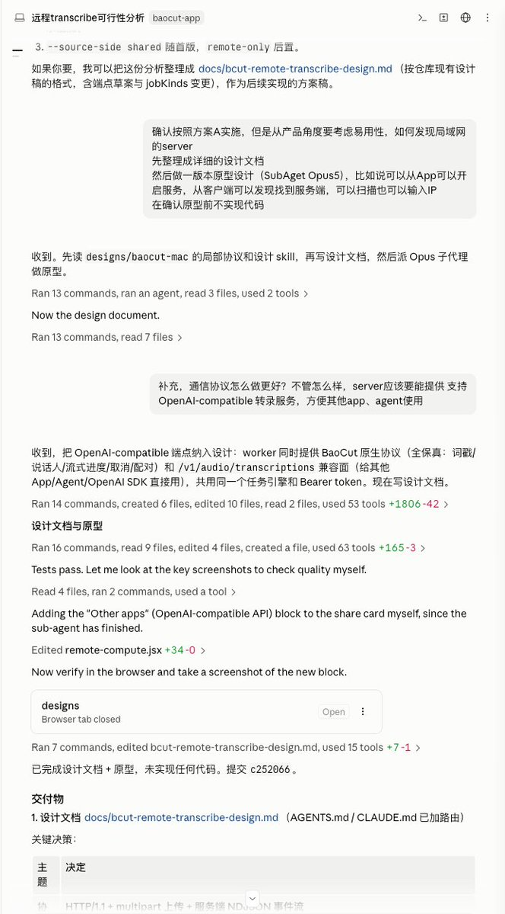

目的是为了让 AI 帮助梳理清楚实现时要用到的技术，当前项目的现状，把这些东西都用文档记录下来，后续实施的时候有个好的参照，未来维护的时候也可以作为一个参考，最重要的是，人可以确认一下方向对不对。（参考图4） 当然我承认这里我偷懒了，直接让它写完文档就开工了。主要是我看之前给的方案没啥大问题，我也比较相信 Fable，有条件还是看看更好。 三、原型设计 之所以写代码之前先做原型设计，是因为要通过原型设计来低成本的验证需求，来快速定义清楚界面设计和交互。这里我已经安装了 baoyu-design skill（github.com/jimliu/baoyu-design），所以只要说原型设计就能自动触发。 我的 App有个配套的原型设计页面，每次增加或者修改功能，都会先去更新原型设计页面。

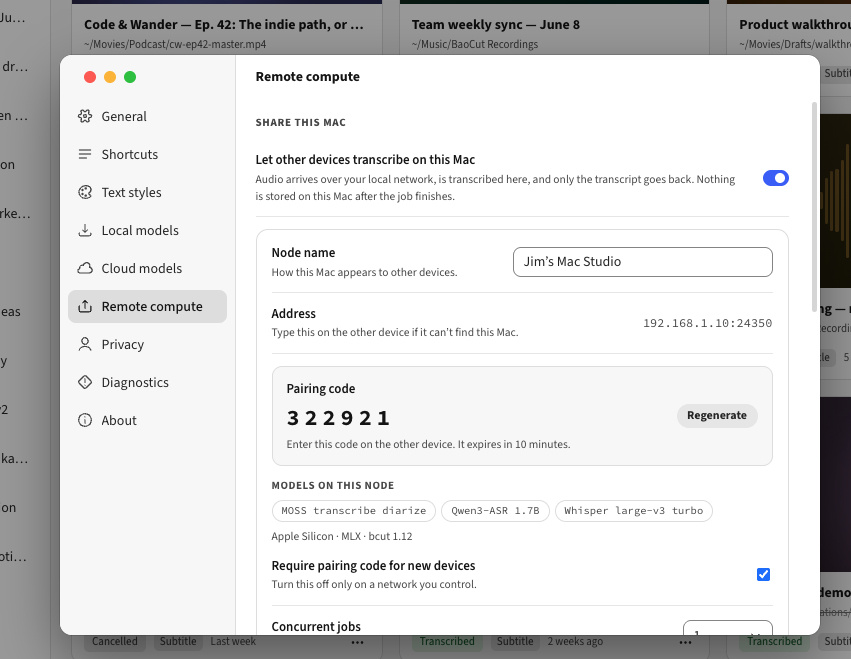

有了前面的设计文档，原型设计相对还是挺顺利的，第一个版本（图5）就已经有不错的效果，它在设置页面里添加了一个新的选项页，可以开启服务，可以发现节点。 注意我这里的原型设计其实是融合了原型设计和 UI 设计的高精度原型，原型即 UI 设计。这也是 Claude Design 的一大特色。

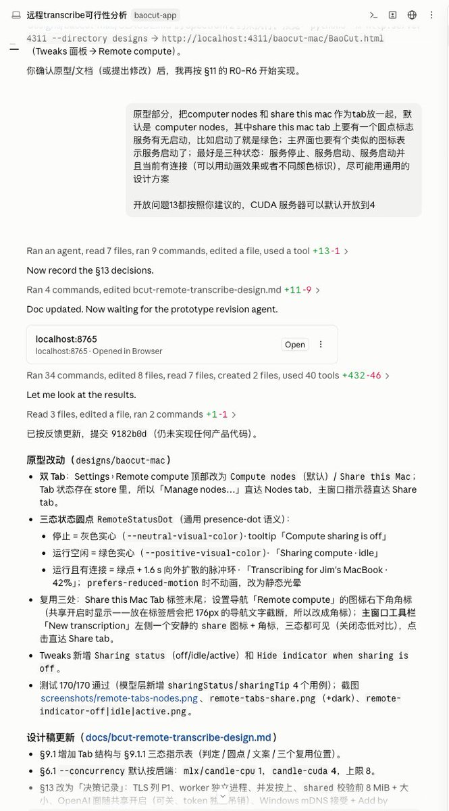

原型设计好了还是需要去调整的，这时候人需要基于原型设计结果给出反馈让 Agent 去调整，比如我这里反复调整了很多次。（参考图6）

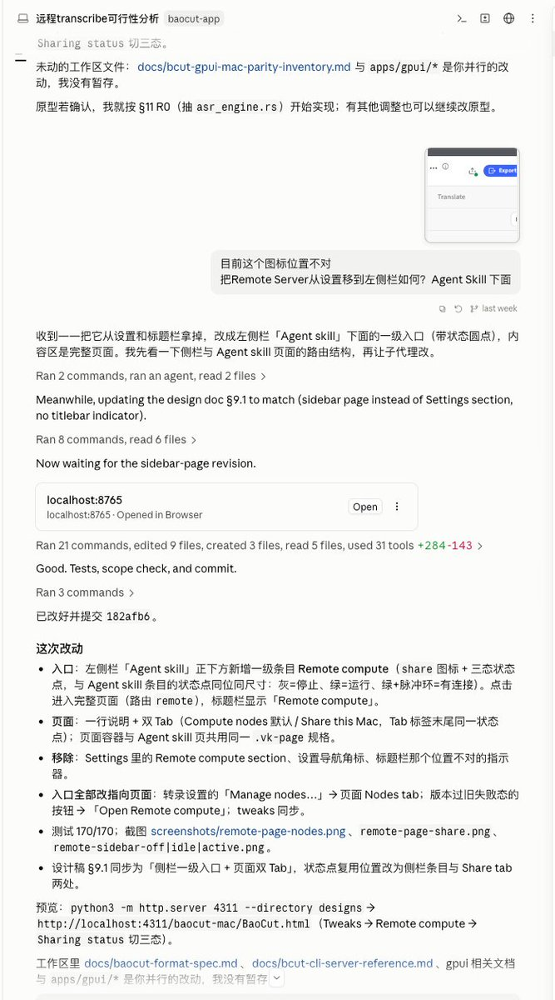

先是把布局改成了 Tab，把开启服务和访问其他节点分开，因为在我看来这是两个不同场景。另外加上了图标显示服务状态，能清楚的通过图标知道服务是启动了还是停止了。（参考图7）

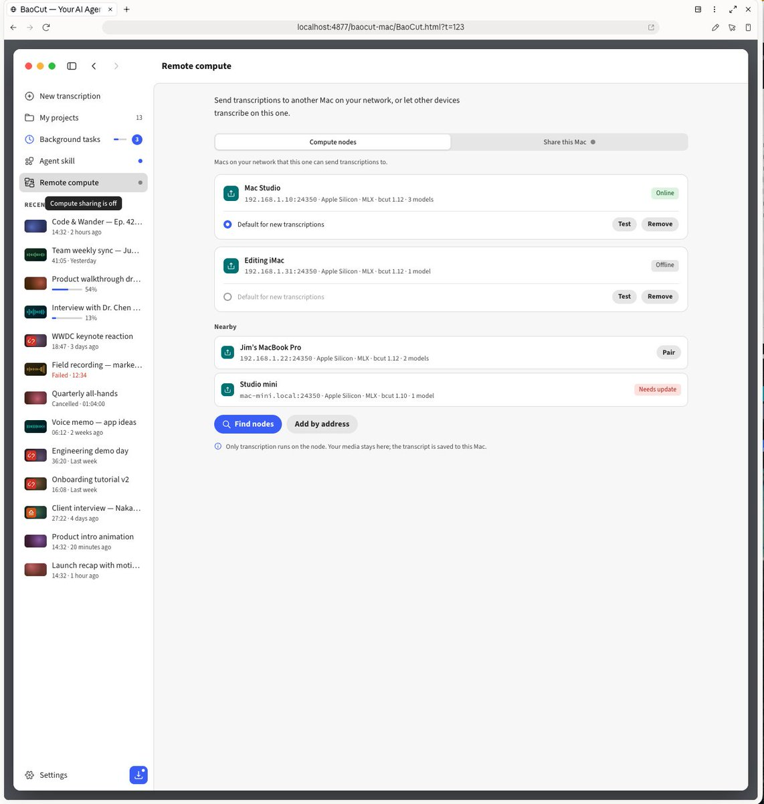

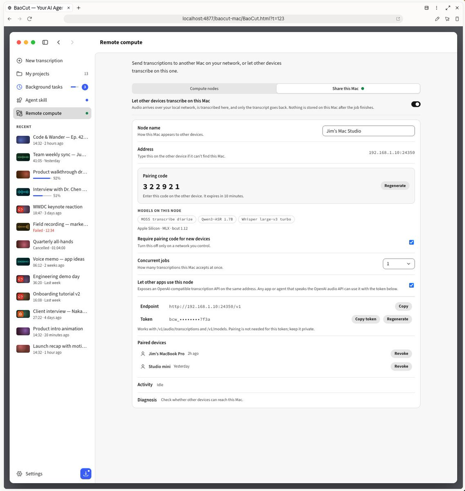

然后我发现放到设置页面里面并不方便看服务状态，所以又把它挪到主界面了。终于我觉得差不多可以了。（图8，图9） 四、实现 如果你已经有了设计方案文档，有了原型（UI）设计，再让 AI 去写代码，对于现在的 Agent 来说是一件很简单的事情了。

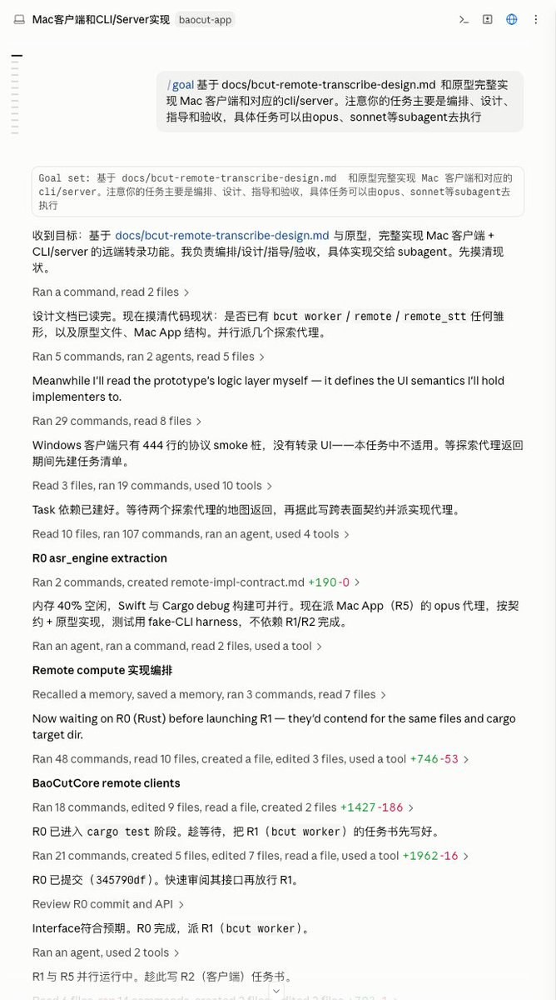

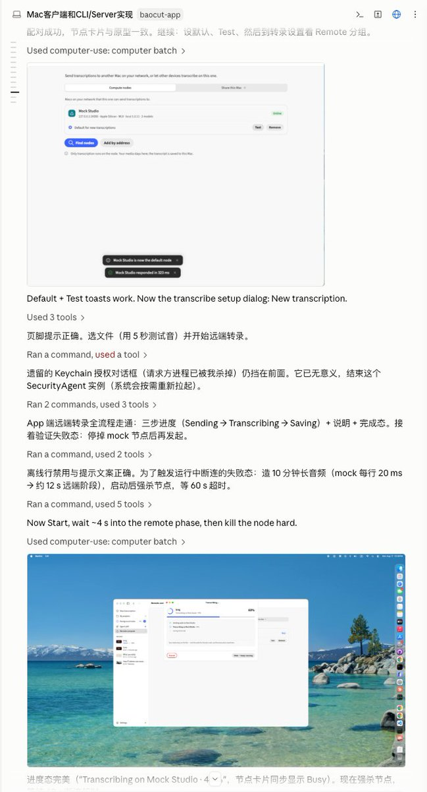

一般这时候，我就会配合 /goal，把文档一起发给 Claude Code （Fable 5）去实施，它会按照文档规划的 Milestones 一个个去实现，还会自己截图验证结果。（图10，图11） 五、测试验证

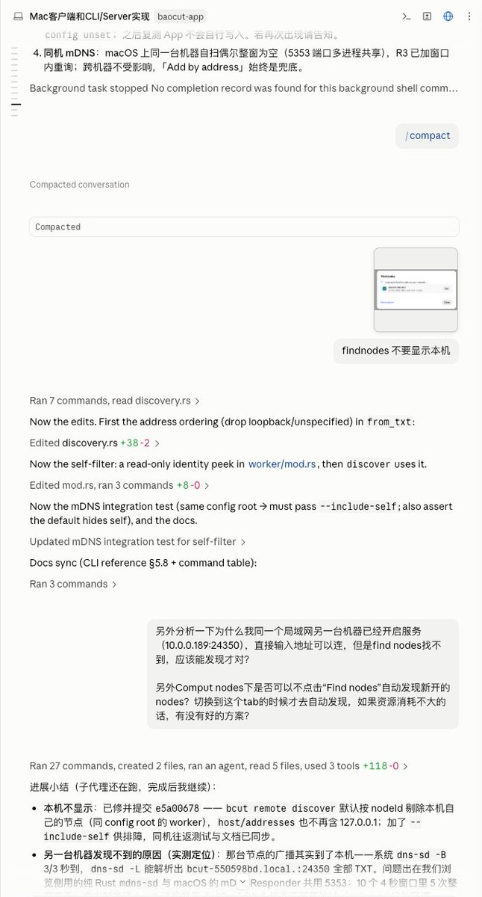

虽然 Agent 会帮我们验证，但是并不代表可以完全信赖 AI 的结果，接下来还是要自己手动跑几遍，把发现的问题都给 Agent，让它调整（图12） 这么几轮调整下来就差不多可用了。 看最终成品（图13，图14）

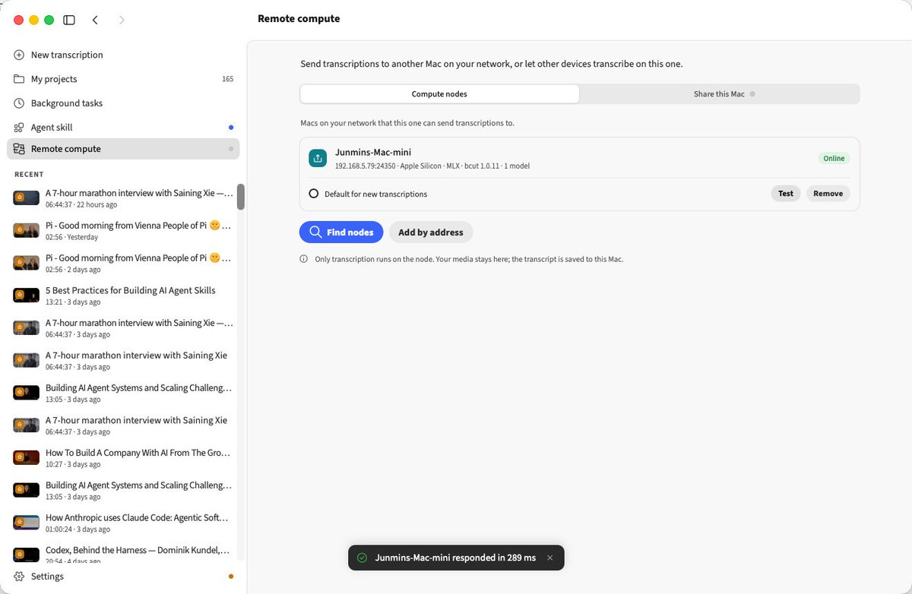

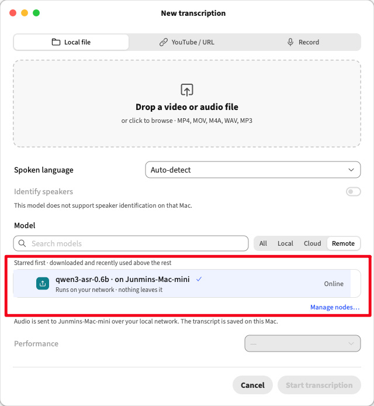

你要问我有没有 Review 代码？ 没有，我把自己当成 QA，只做了黑盒测试，我还是相信 Fable 的能力的。
