# 大模型怎么“自己教会自己”？Qwen 用 Skill 库破解自博弈死结 - 哔哩哔哩

一个模型怎样才能真正“自己教会自己”？ 最直觉的答案，是让它一边出题、一边解题，再根据结果继续训练。

## Source details

- Source: https://www.bilibili.com/opus/1245575923568214023
- Author: 唐国梁Tommy

## Captured content

一个模型怎样才能真正“自己教会自己”？

最直觉的答案，是让它一边出题、一边解题，再根据结果继续训练。这个思路叫自博弈。但当棋盘换成开放世界，问题马上出现：模型要么只能在代码执行器、游戏模拟器等封闭环境里练习，验证准确却题型狭窄；要么放开手脚自由出题，覆盖面扩大了，错误任务和伪答案也会混进训练数据。

论文：Skill Self-Play: Pushing the Frontier of LLM Capability with Co-Evolving Skills
链接：https://arxiv.org/abs/2607.22529

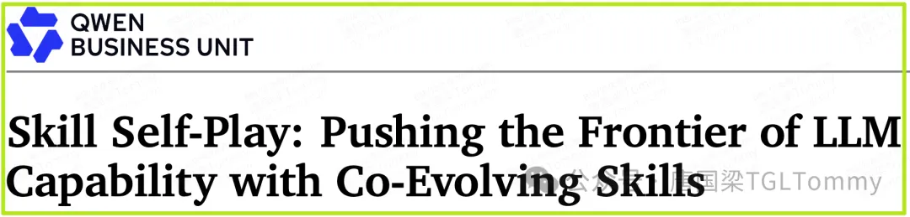

自进化最难的从来不是“生成更多题”，而是持续生成既可验证、又贴着能力边界的新题。

阿里 Qwen 团队联合多所高校提出的 Skill Self-Play，试图用一套会进化的技能库破解这个矛盾。论文的关键变化是：技能不再只是推理时调用的工具包，而成为训练阶段组织任务、验证答案和推动课程进化的接口。

这篇文章主要回答四个问题：

1. Skill 在训练里到底做了什么？
2. 为什么成功率约 50% 的题最有学习价值？
3. 技能库怎样自己扩张和淘汰？
4. 这套方法还有哪些边界？

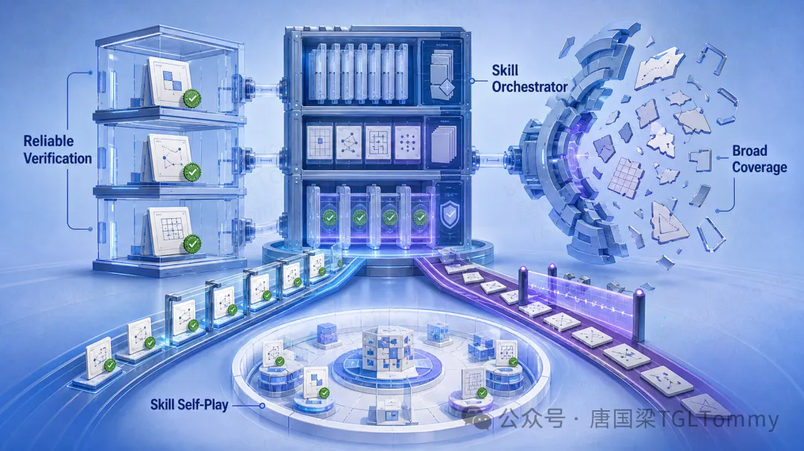

## 自进化的死结：窄而准，还是广而脏

现有方法大致站在两个极端。

一端是环境绑定型自博弈。代码可以跑单元测试，游戏有明确胜负，工具调用也能检查参数结构，因此奖励信号可靠。但环境先定义了边界，模型只能在有限的任务分布里变强。

另一端是开放式任务生成。模型自由提出新问题，再用格式检查、多数投票等方式事后过滤。它看起来更开放，却容易生成条件缺失、答案不唯一或模板化的问题。过滤器像一张被动的筛网，只能挡住明显错误，不能在出题之前提供结构约束。

更危险的是，这些噪声会在多轮自训练中累积。模型用自己生成的低质量数据继续训练自己，最终可能不是进化，而是把偏差越放越大。

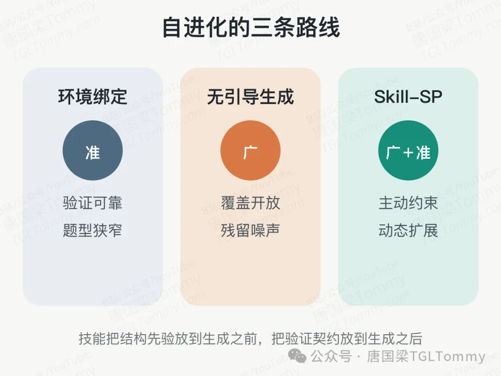

## 技能不是“插件”，而是任务模式接口

Skill-SP 把技能定义为一个结构化包，其中包含路由元数据、操作规则、生成提示、少量示例、可执行验证器，以及历史使用统计。它不是一段泛泛的提示词，而是一份可复用的任务模式契约。

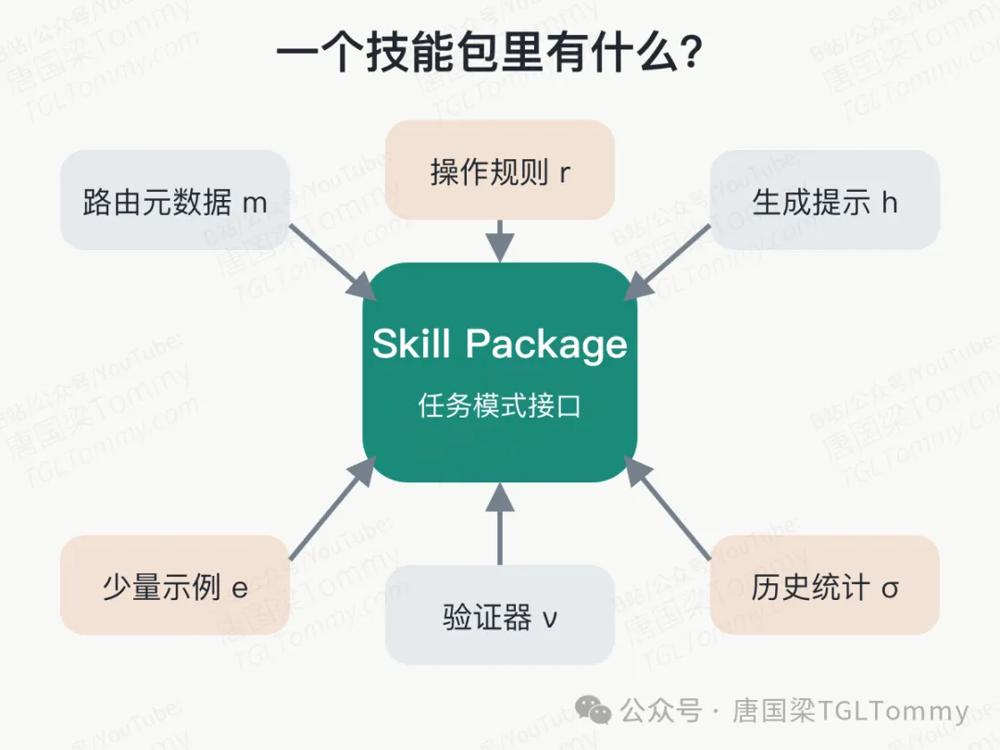

这份契约同时解决三个问题。

第一，它在出题前向模型注入结构先验，告诉模型这类任务应该怎样构造。

第二，它在出题后提供专用验证器，检查任务是否真的成立。

第三，它记录成功率和任务价值，用于决定下一轮该多练什么、少练什么。

相比把所有历史轨迹塞进上下文，技能包把分散经验压缩成了可路由、可检查、可更新的知识单元。训练经验第一次有了稳定的“中间表示”。

## 三个角色，组成一台课程生成机器

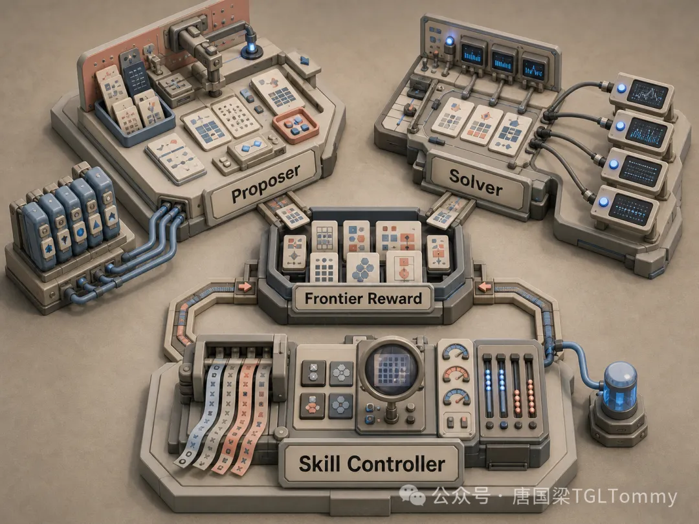

整个系统由三个角色协同运转：Proposer 负责出题，Solver 负责解题，Controller 负责维护技能库。

每一轮开始时，路由器从技能库中采样一个技能。Proposer 在技能约束下生成候选任务和隐藏的机器可读验证契约；Solver 多次尝试解题；环境根据契约给出可验证奖励。合格任务再按难度排序，进入下一轮训练池。

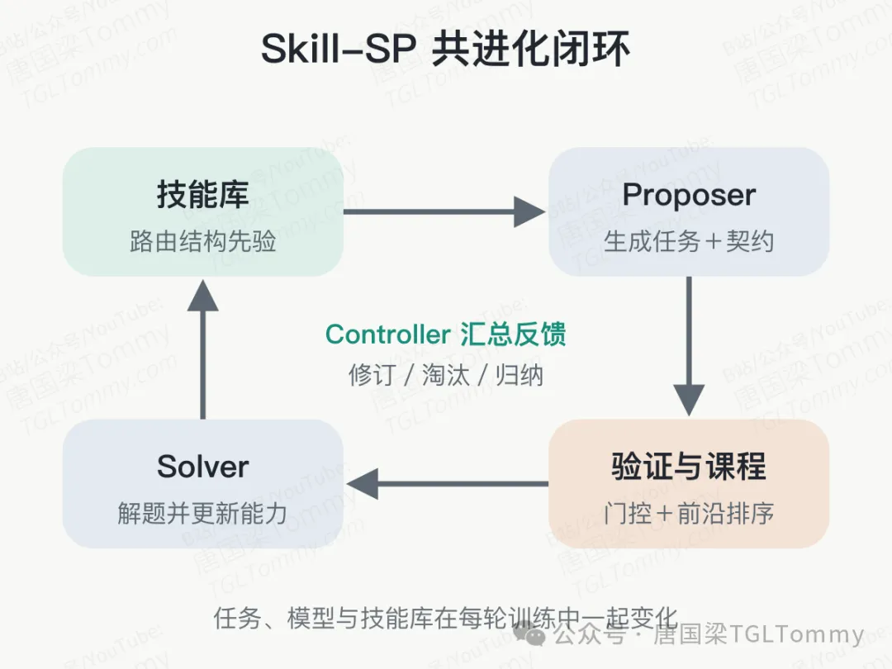

这里最精巧的设计，是让当前的 Solver 同时充当经验难度计。如果一道题成功率接近 100%，它太简单；接近 0%，它可能太难，甚至根本不成立。系统把成功率约为 50% 的任务视为学习前沿，并给这类任务更高的课程奖励。

但只追求“难”会诱发奖励投机：出一道有缺陷、谁都答不出的题，也能制造低成功率。于是论文加入硬门控，只有同时满足结构格式、验证契约和探测一致性的任务，才有资格获得奖励。

Skill-SP 的核心不是让模型更会出难题，而是把有效性门控和边界难度绑在同一个奖励里。

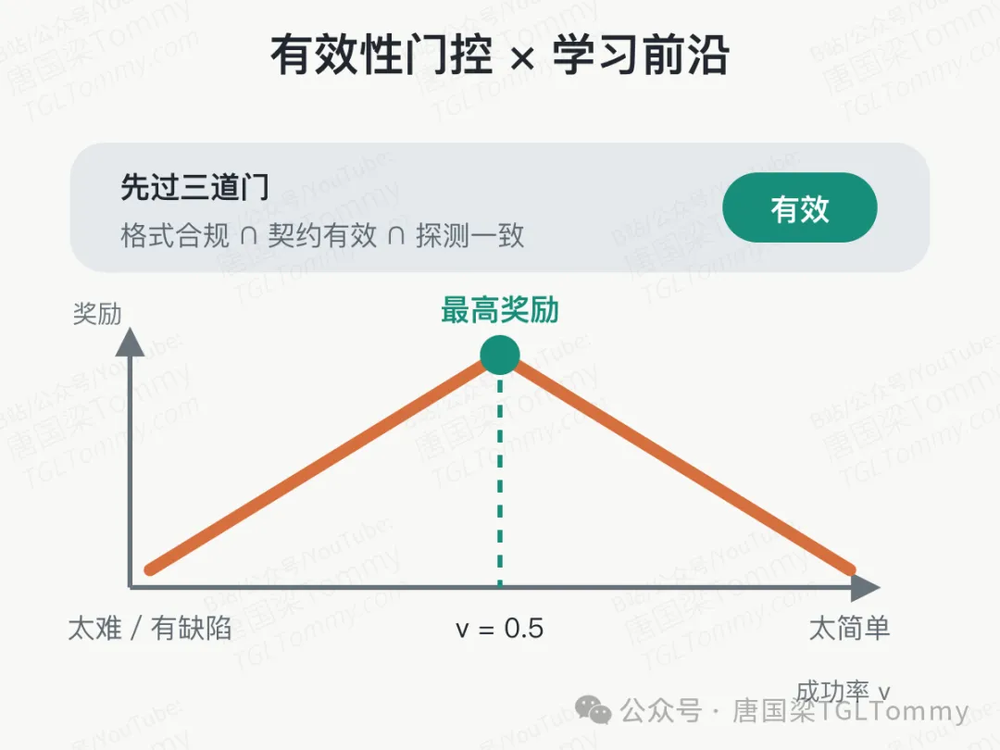

## 双流生成：结构与开放性同时保留

如果所有任务都由现有技能生成，系统又会回到“窄而准”的老路。为此，论文设计了两条数据流。

技能流负责稳定产出结构正确、可严格验证的任务；探索流不受技能约束，专门寻找尚未被技能库覆盖的新模式。最终训练池按照固定比例混合两路数据，并优先选择最接近当前能力边界的题目。

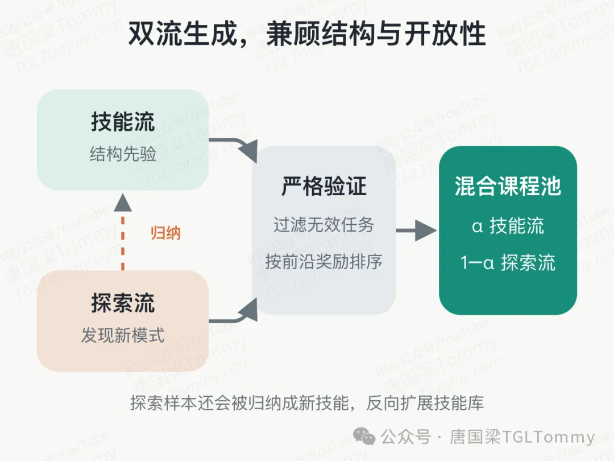

探索流中那些新颖、有效且具有合适难度的样本，还会被 Controller 抽象为新技能。与此同时，旧技能会根据失败轨迹被修订；长期只能生成简单题的技能则被归档。技能库由此形成三种动作：修订、淘汰、归纳。

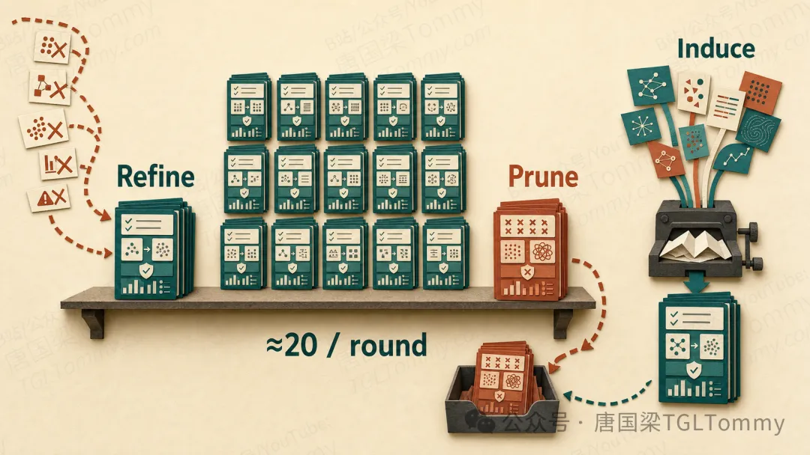

这意味着课程不是预先排好的目录，而是一张随模型能力不断改写的地图。模型变强之后，昨天的难题会被降权，新的任务模式会被提炼出来，继续把训练推向未知区域。

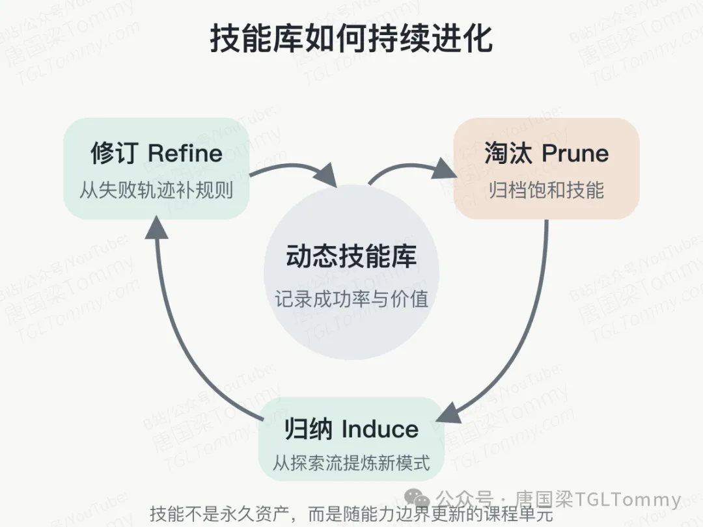

## 实验结果：提升来自“会进化的结构”

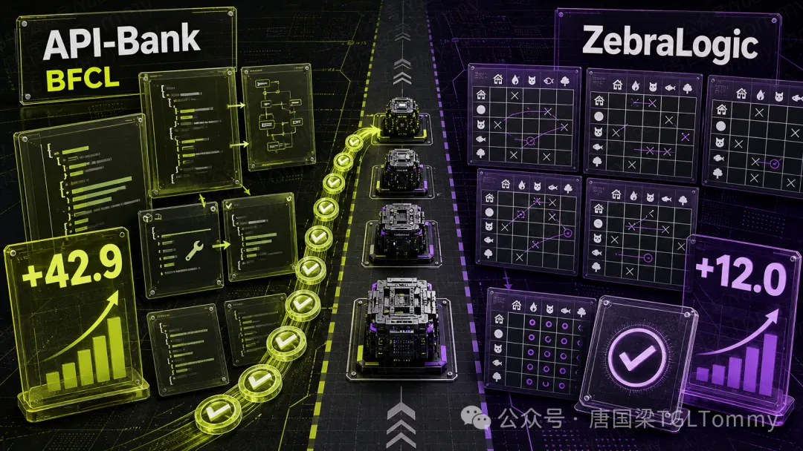

论文在工具调用和逻辑推理两类可验证任务上测试了五个 3B 到 14B 的开源模型。训练进行五轮，工具调用覆盖 API-Bank 与 BFCL，逻辑推理采用 ZebraLogic。

结果显示，Skill-SP 在五个骨干模型上都带来正向提升。工具调用的最大绝对增益达到 42.9 个点，出现在原本难以遵循工具结构的 Ministral-3-8B 上；逻辑推理的总体网格准确率最大提升 12.0 个点。对本来就较强的 Qwen3-4B-Instruct，工具调用综合得分也从 60.2 提升到 66.7。

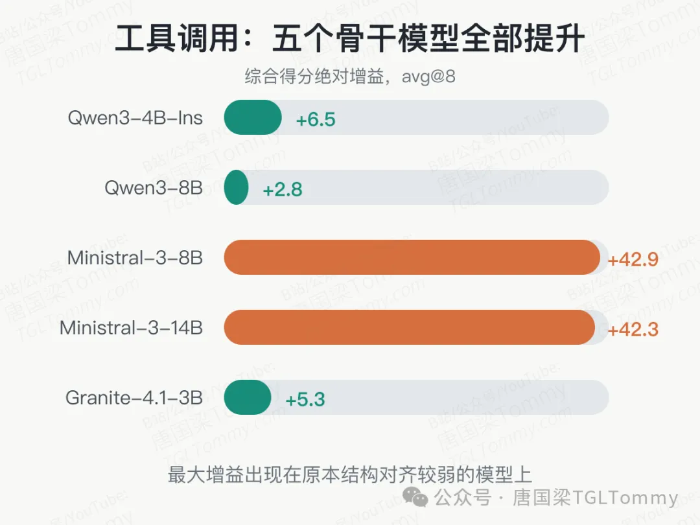

消融实验更能说明机制。移除技能编排的无引导自博弈，比完整系统低 2.6 个点；使用均匀路由低 1.9 个点；冻结技能库低 2.3 个点；同时冻结出题者和反馈解题者，下降达到 3.2 个点。真正起作用的不是静态技能提示，而是任务、模型与技能库的共同更新。

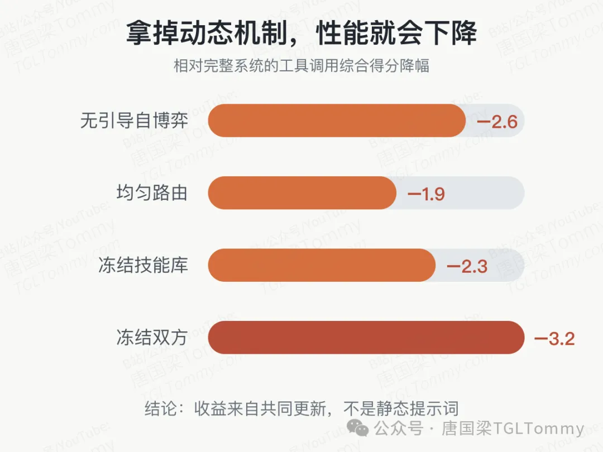

诊断数据也支持这一点。技能流任务的平均解题成功率约为 0.57，比无引导自博弈的 0.70 和自由探索流的 0.75 更接近理论上的前沿位置 0.50。五轮训练后，活跃技能达到 86 个，按使用分布折算的有效技能数达到 46 个；每轮还会归纳约 20 个新技能包。

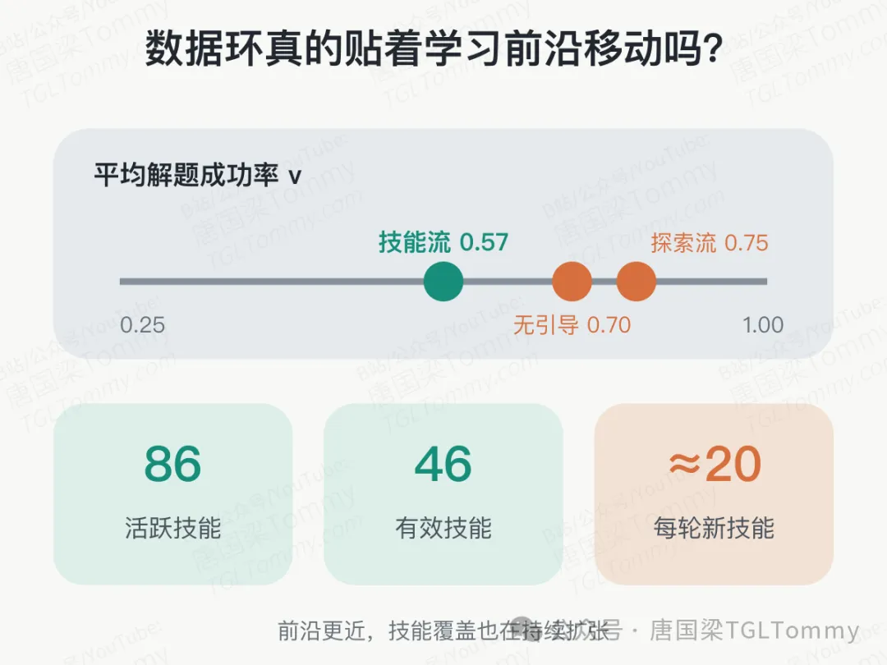

## 这项工作仍有哪些边界

首先，论文验证的是可机器判定的任务：工具调用有结构契约，逻辑谜题有确定性检查器。对于开放写作、战略判断、社会互动等缺少可靠判据的任务，这套框架能否维持同等质量，论文还没有回答。

其次，自博弈并不免费。每轮要生成候选任务、进行多次探测、执行验证，再分别更新出题者和解题者。论文证明了方法有效，但训练成本与收益在更大模型、更长周期上的关系仍需进一步评估。

第三，弱模型仍需要最低启动能力。论文明确指出，能力较弱的模型在 ZebraLogic 的大规模和超大规模谜题上提升有限；无引导方法甚至无法生成足够有效的推理题来启动训练。这说明技能可以提供脚手架，却不能凭空创造底层推理能力。

最后，技能的完整性、新颖性判断依赖控制器和规则阈值。技能库越大，重复、漂移和错误验证器的治理就越重要。论文展示了五轮内的健康增长，但长期运行是否会出现“技能债务”，仍是一个开放问题。这里属于基于论文机制做出的进一步推断，而非作者已经验证的结论。

## 从数据飞轮，走向“接口飞轮”

过去谈模型自我进化，重点常放在生成多少数据。Skill-SP 提供了另一种视角：决定上限的也许不是数据量，而是经验能否被压缩成结构清晰、可执行、可淘汰的接口。

技能在这里像训练系统里的中间层：向上约束任务生成，向下连接验证器，横向记录课程状态。原始轨迹不再只是一次性数据，而能沉淀为下一轮可以复用的程序化知识。

这项工作还没有解决所有开放世界任务的自验证难题，但它给出了一条很有力量的路线：先让模型在可验证区域里学会生成规则，再让规则本身跟着模型一起进化。

真正可持续的自我进化，不是让模型无限复制自己的答案，而是让它不断改造自己用来学习的规则。

如果把这套思路放进真实 Agent 系统，你最希望 Skill 库学会什么：生成任务、维护验证器，还是从失败轨迹中归纳新规则？

## 进阶学习

如果你正在关注大模型 Agent、强化学习后训练、RLHF、DPO、GRPO、RLVR 等前沿方向，欢迎学习我最新上线的精品课程：[《大模型 Agent 强化学习实战》​​​​​​​​​​​​​​​​​​​​​​​​​​​​](https://www.bilibili.com/cheese/play/ss842375604?spm_id_from=333.1369.0.0&spm_id_from=333.1369.0.0&spm_id_from=333.1369.0.0&spm_id_from=333.1369.0.0&spm_id_from=333.1369.0.0&spm_id_from=333.1369.0.0&spm_id_from=333.1369.0.0&spm_id_from=333.1369.0.0&spm_id_from=333.1369.0.0&spm_id_from=333.1369.0.0&spm_id_from=333.1369.0.0&spm_id_from=333.1369.0.0&spm_id_from=333.1369.0.0&spm_id_from=333.1369.0.0&spm_id_from=333.1369.0.0&spm_id_from=333.1369.0.0&spm_id_from=333.1369.0.0&spm_id_from=333.1369.0.0&spm_id_from=333.1369.0.0&spm_id_from=333.1369.0.0&spm_id_from=333.1369.0.0&spm_id_from=333.1369.0.0&spm_id_from=333.1369.0.0&spm_id_from=333.1369.0.0&spm_id_from=333.1369.0.0&spm_id_from=333.1369.0.0&spm_id_from=333.1369.0.0&spm_id_from=333.1369.0.0)

这门课会系统讲解从 RLHF 到 Agentic RL 的完整演进，并结合 Verifiers、Reagent、VeRL、DeepAnalyze、OpenClaw-RL、Memento-Skills 等项目，把奖励设计、信用分配、训练系统和 Skill 自进化串成一条完整主线。

此外，课程配套整理了知识库文档《Agent RL 学习宝典》，包含学习路线、课程资料、论文整理、项目说明、源码辅助资料和持续更新内容，方便大家在学习过程中随时查阅，也帮助大家后续长期跟进前沿技术变化。

🎯课程官网：https://www.tgltommy.com/p/agent-rl（国内访问需科学上网）📺B站课堂：[《大模型 Agent 强化学习实战》​​​​​​​​​​​​​​​​​​​​​​​​​​​​](https://www.bilibili.com/cheese/play/ss842375604?spm_id_from=333.1369.0.0&spm_id_from=333.1369.0.0&spm_id_from=333.1369.0.0&spm_id_from=333.1369.0.0&spm_id_from=333.1369.0.0&spm_id_from=333.1369.0.0&spm_id_from=333.1369.0.0&spm_id_from=333.1369.0.0&spm_id_from=333.1369.0.0&spm_id_from=333.1369.0.0&spm_id_from=333.1369.0.0&spm_id_from=333.1369.0.0&spm_id_from=333.1369.0.0&spm_id_from=333.1369.0.0&spm_id_from=333.1369.0.0&spm_id_from=333.1369.0.0&spm_id_from=333.1369.0.0&spm_id_from=333.1369.0.0&spm_id_from=333.1369.0.0&spm_id_from=333.1369.0.0&spm_id_from=333.1369.0.0&spm_id_from=333.1369.0.0&spm_id_from=333.1369.0.0&spm_id_from=333.1369.0.0&spm_id_from=333.1369.0.0&spm_id_from=333.1369.0.0&spm_id_from=333.1369.0.0&spm_id_from=333.1369.0.0)

🌟更多精品课程与学习资源请访问：

- TGLTommyAI 学习中心：https://synergyfuture.feishu.cn/wiki/LQKNwhbZDidLj4kTTRWcH7utnic
- 官方网站：TGLTommy.com（国内访问需科学上网）
- B站课堂：[TGLTommyAI的空间](https://space.bilibili.com/3546748815411393)（请在“课堂”下方查看）

🎯关注微信公众号：唐国梁TGLTommy

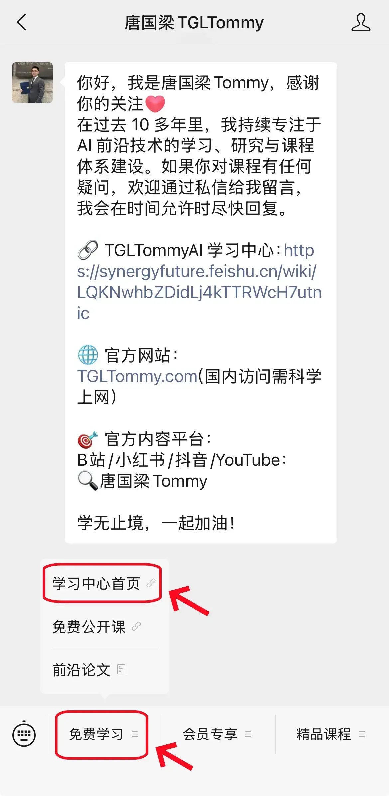

[#Qwen#](https://search.bilibili.com/all?keyword=Qwen) [#通义千问#](https://search.bilibili.com/all?keyword=%E9%80%9A%E4%B9%89%E5%8D%83%E9%97%AE) [#Qwen3#](https://search.bilibili.com/all?keyword=Qwen3) [#Skill#](https://search.bilibili.com/all?keyword=Skill) [#Self-Play#](https://search.bilibili.com/all?keyword=Self-Play) [#大语言模型#](https://search.bilibili.com/all?keyword=%E5%A4%A7%E8%AF%AD%E8%A8%80%E6%A8%A1%E5%9E%8B) [#LLM#](https://search.bilibili.com/all?keyword=LLM) [#强化学习#](https://search.bilibili.com/all?keyword=%E5%BC%BA%E5%8C%96%E5%AD%A6%E4%B9%A0) [#自博弈#](https://search.bilibili.com/all?keyword=%E8%87%AA%E5%8D%9A%E5%BC%88) [#AgentSkills#](https://search.bilibili.com/all?keyword=AgentSkills) [#AIAgent#](https://search.bilibili.com/all?keyword=AIAgent) [#工具调用#](https://search.bilibili.com/all?keyword=%E5%B7%A5%E5%85%B7%E8%B0%83%E7%94%A8) [#模型训练#](https://search.bilibili.com/all?keyword=%E6%A8%A1%E5%9E%8B%E8%AE%AD%E7%BB%83) [#自我进化#](https://search.bilibili.com/all?keyword=%E8%87%AA%E6%88%91%E8%BF%9B%E5%8C%96) [#论文解读#](https://search.bilibili.com/all?keyword=%E8%AE%BA%E6%96%87%E8%A7%A3%E8%AF%BB) [#唐国梁Tommy#](https://search.bilibili.com/all?keyword=%E5%94%90%E5%9B%BD%E6%A2%81Tommy) [#TGLTommyAI#](https://search.bilibili.com/all?keyword=TGLTommyAI)
