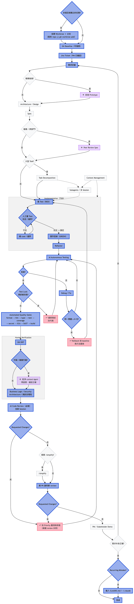

# AI 工作流 vs. Harness Engineering

最近面試被問到是怎麼進行 Harness Engineering，結果當下回答得沒有很好，把 AI 工作流跟 Harness Engineering 搞混了，導致後面的問題有點接不下去。

## Source details

- Source: https://medium.com/@june-in-exile/ai-%E5%B7%A5%E4%BD%9C%E6%B5%81-vs-harness-engineering-f9a378cea385?source=rss-28bd75766d57------2
- Feed: Stories by June on Medium
- Author: June

## Captured content

最近面試被問到是怎麼進行 Harness Engineering，結果當下回答得沒有很好，把 AI 工作流跟 Harness Engineering 搞混了，導致後面的問題有點接不下去。
下面分享一下我的 AI 工作流，以及我對 Harness Engineering 的看法 (AI 相關的名詞日新月異，有時候我自己也沒搞明白，疏漏之處請不吝指教)：
首先，上圖！
我的 AI 工作流
圖例：
藍實心 = 每個任務都要做
灰虛線 = Standard 以上的任務才做，Lite 可跳過
紫虛線 = Heavy 的任務才做，Standard / Lite 可跳過
紅色 = 出錯才走的回頭路 (不受任務複雜度影響)
我對任務複雜度分類如下
Lite: 單一檔案的小修改、config、文案、log 等
Standard: 一般 feature / bugfix
Heavy: 跨模組、動到金流 / 合約 / 權限…等
(這只是大致分類，實務上還會考量緊急程度、團隊對該 feature 的重視程度、執行過程中出現的外部因素等等)
大致步驟說明如下：
Step 0: Git Version Control / Workflow
每一步都可回復。
開始前建立 Git 基準點，重要階段持續 commit，確保 AI 犯錯時可以快速 rollback。
為了加快開發速度，可以透過 git worktree 將互相獨立的任務同時進行，做完後各自開 PR、各自走完整 review
Step 1: Requirement → Prototype → Architecture
先確認需求，再深入技術。
需求不用手動輸入，太麻煩了，直接從已經跟 PM 確認過的 Jira ticket 讀下來就好。(PM 通常也是用 agent 產生 ticket)
對於後端較複雜的專案，可以先做簡單前端 Demo，確認 user flow 後再設計架構。
Step 2: Spec → Task Decomposition
大型需求先拆成解耦任務。
將大型需求拆成具備清楚介面、輸入輸出與驗收條件的小任務，方便獨立實作與驗證。
Spec 不一定只有自己看：複雜或跨部門的任務，讓主管或是相關功能的負責人一起 review spec，在實作前就對齊介面與責任邊界。
大型工作優先拆 task，再使用 subagent、compact 或新 session，避免單一 context 過度膨脹。
Step 3: Implementation (TDD)
先寫 test，再寫實作。
RED ：依照 spec 的驗收條件先寫測試，測試本身就是 spec 的可執行版本。
檢查測試 ：請 agent 講一下目前寫了哪些 test case，再去判斷還有什麼情況沒測試到。
GREEN ：讓 agent 依照 spec、task 定義與既有專案規範實作到測試全綠。
Refactor ：在測試的保護下對實作進行 refactor。
Test lock
這邊要注意 test 是否有被修改到，有時候 agent 為了讓任務通過，會去修改測試而不是改代碼。如果該測試已經人為確認過沒問題，就不應該讓 agent 再去改它。
如果真的有測試檔被修改，可以透過 git diff 查看具體測試檔被改了什麼，有時候 agent 是把測試改得更嚴格，這時候人工重新確認一遍測試即可。但如果是斷言被放寬、被加 skip／only、被刪 case、被改期望值等情況，就要先把測試還原，並要求 agent 重新實作。
Step 4: AI Autonomous Testing
讓 AI 自己操作環境測試。
依專案需求給予 local、browser、database 或 blockchain RPC 權限，讓 AI 執行真實流程。
Step 5: Debug → Fix → Retest (含 Attempt Budget)
AI 發現問題後自行迭代，但迴圈一定要有停損。
AI 根據測試結果修改程式，再重新測試，直到達到 spec 與 acceptance criteria。
Attempt budget: 同一個問題修 N 次 (我是預設 2-3 次) 還不過，不准繼續補，直接 git reset 回到 baseline 或前一個 commit，換一個做法重做。這是為了 AI 卡住時無限 patch ，每一輪都在前一輪的錯誤假設上疊加，最後產出一坨誰都看不懂的屎山代碼。rollback 重來通常比繼續修快，而且乾淨。
超過 budget 時可順手升級手段：換乾淨 context 的 session 重述問題、縮小重現範圍、或先補一個更小的 failing test 再說。
Step 6: Automated Quality Gates
程式必須通過固定品質門檻。
依序執行：
Formatter
Linter
Type check
Tests
Coverage gate
Secret scanning（gitleaks / trufflehog：私鑰、API key、助記詞）
Dependency / SCA 掃描（npm audit、osv-scanner、lockfile 異動檢查、供應鏈投毒等）
SAST
Build
人工只該負責「機器擋不掉的」判斷 (business logic、架構、威脅模型等)，機器擋得掉的漏洞不該進到人的視線。
Step 7: Human Verification
機器擋完之後，換人把關。這一步包含以下所有人工確認動作：
Git Diff：檢視 AI 實際修改內容，確認 API、data flow、安全性與非預期修改。
可疑或複雜代碼 → 開乾淨 context 的 agent：另外開一個全新、乾淨 context 的 agent，請它解釋該段代碼的意涵並確認功能正確。
Business logic / Security / Architecture / 測試合理性：確認需求與設計真的被正確實現，而不只是測試通過。不過這部份光看 diff 通常看不太出來，仍然是透過跟 AI 交互的方式確認。
Step 8: AI Code Review
人看完，再讓 AI 從零重看一次。
每次都一定要做，不分改動大小：開一個全新 session 並下達 review 工作，不沿用實作 session 的 context。
Heavy 改動拆成多角色分別 review：security / performance / consistency，平行跑。
Requested changes 依變更處理流程處理。
變更處理流程
不管意見來自 AI code review 還是同事的 PR review，處理方式都是同一套：
1. 依 priority 排序。
2. 逐項釐清：意見是否成立、是否誤解 context，不合理的就回覆說明而非照單全收。
3. 修復成立的項目。
4. 回到 AI Autonomous Testing → Automated Quality Gates 重跑一輪，再往下走。
Step 9: /simplify（視情況）→ Pull Request → Peer Review
AI review 過了，需要的話先收乾淨，再交給人。
/simplify 視情況跑：這次改動如果在 debug 與 review 迴圈裡疊出冗餘、重複邏輯或歪掉的抽象層級，就跑一次把 reuse、簡化、效率清理完再送人；乾淨的小改動不用跑。
推上 GitHub 開 PR，請主管或是熟悉該模組的人 review：PR 描述帶上完整 commit history 的摘要與 test plan。
Requested changes 依前述的變更處理流程處理。
Step 10: Final Demo — 需求回饋
Jira ticket 是單一事實來源，但單一事實來源本身可能就是錯的。
合併前（或合併後立即）對 PM / stakeholder demo 實際行為，而不是報告「做完了」。
若需求有誤 → 回到步驟 1 需求討論，更新 ticket 後重走，而不是在既有實作上硬凹。
Step 11: Knowledge Capture
把重複錯誤轉成永久規則。
將常犯錯誤與專案規範寫入 CLAUDE.md、AGENT.md 或 ~/.claude，降低未來重犯機率。
關於 Harness Engineering，我理解的意思是把 AI 包進一層框架裡 — — 執行環境、工具權限、自動化回饋迴圈、護欄、停損與 context 管理等等，讓人類只需要在關鍵節點介入，把心力集中在真正需要判斷的地方。
以我目前工作流而言，除了需求釐清 (Step 1)、人工檢查 (Step 7)、需求回饋 (Step 10) 必須要有人類介入進行價值判斷，其餘部份都可以讓 AI 自動化，屬於 Human-in-the-loop 的 Harness Engineering。
面試的時候如果被問的是 AI 工作流，就照上面流程回答。但如果被問的是如何進行 Harness Engineering，則要聚焦在以下重點：
如何設計任務執行環境與工具權限
Ans: 把 agent 關進獨立的 sandbox / worktree，只開放它該碰的檔案與指令，資料庫給唯讀連線、金鑰與 production 一律不進 context
如何建立自動化回饋迴圈
Ans: 每次產出後自動跑測試、type check、lint 與 build，把錯誤訊息餵回 agent 讓它自己修到測試通過，而不是人工複製貼上
如何設置護欄、停損
Ans: 限制最大迭代次數與 token 預算、同一個錯誤重試 N 次仍失敗就中止並回報、刪改 DB 或發交易等破壞性操作強制人工確認
如何管理 context
Ans: 用 sub-agent 分工各自帶精簡 context、只餵相關檔案與規格而非整包 repo、把長期規則寫進 CLAUDE.md／memory 讓它跨回合保持一致
如何選擇人類介入的節點
Ans: 將人類介入放在價值判斷密度最高的地方，包含需求釐清、產出檢查、方向回饋
隨著 Codex, Claude Code 等工具越來越進步，人為介入以外的 Harness 會漸漸採用官方預設的實作。由於官方把細節都封裝好了，平常開發時很容易忘記底下其實包了這麼多機制。這次為了準備面試，才意識到自己在 agentic coding 時其實一直在做 Harness Engineering，算是挺不錯的收穫！

