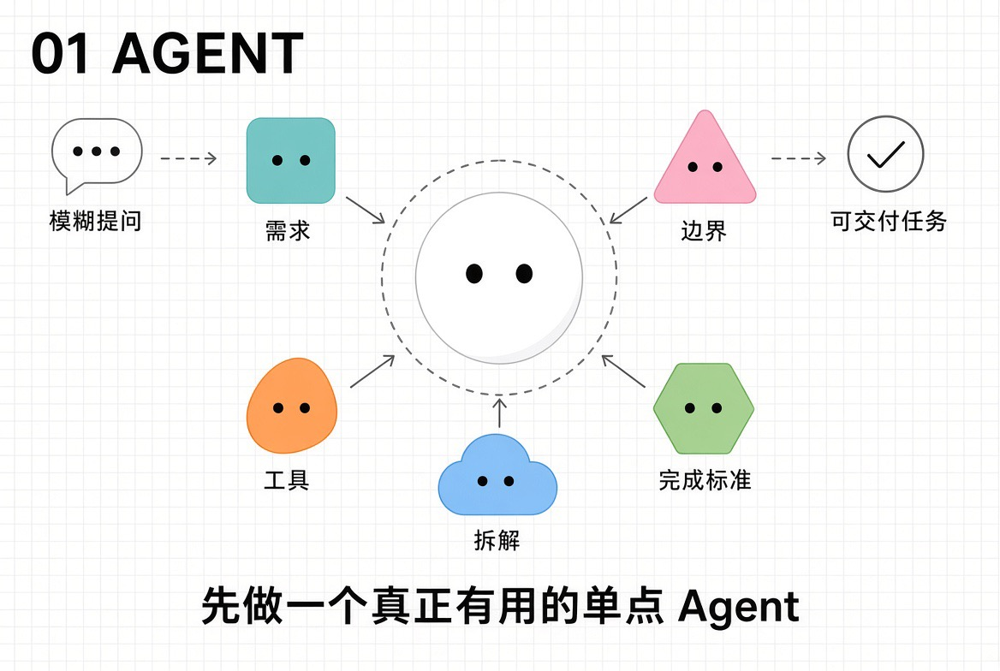
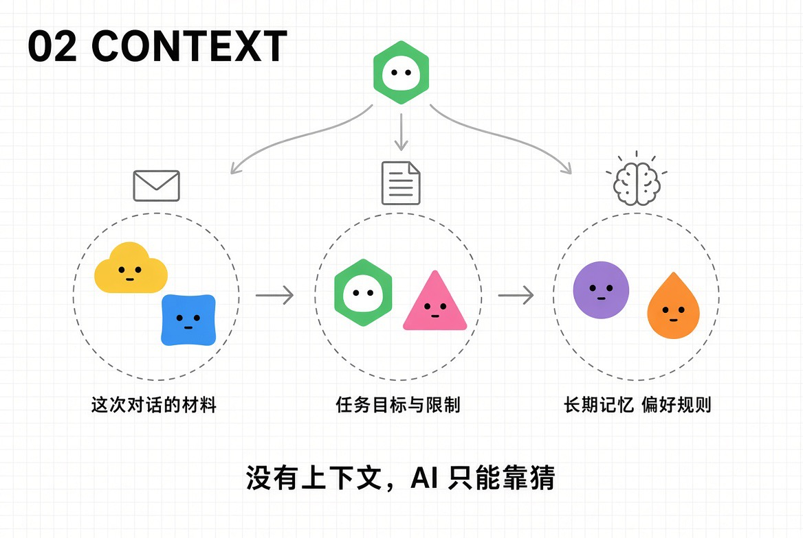
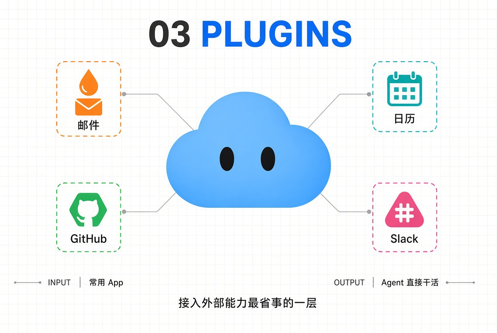
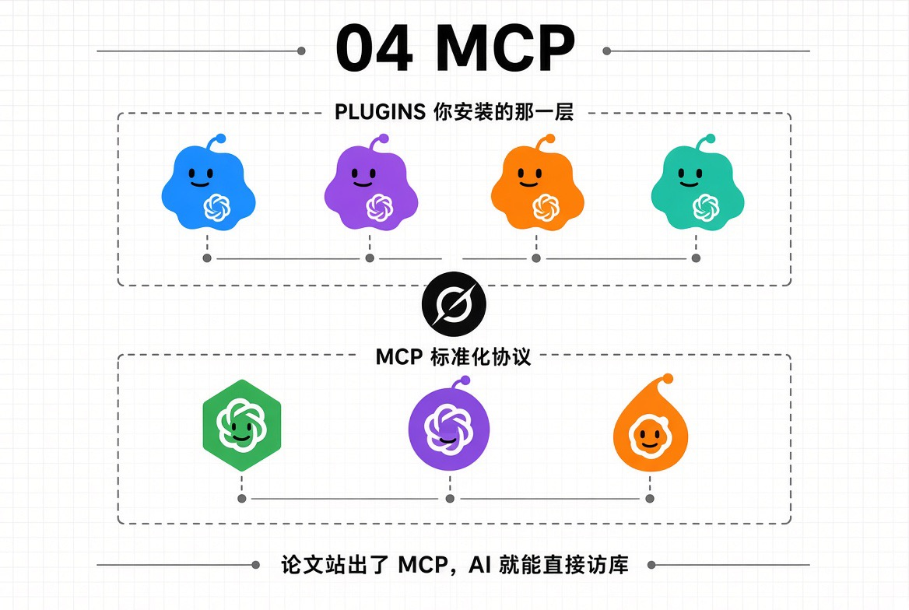
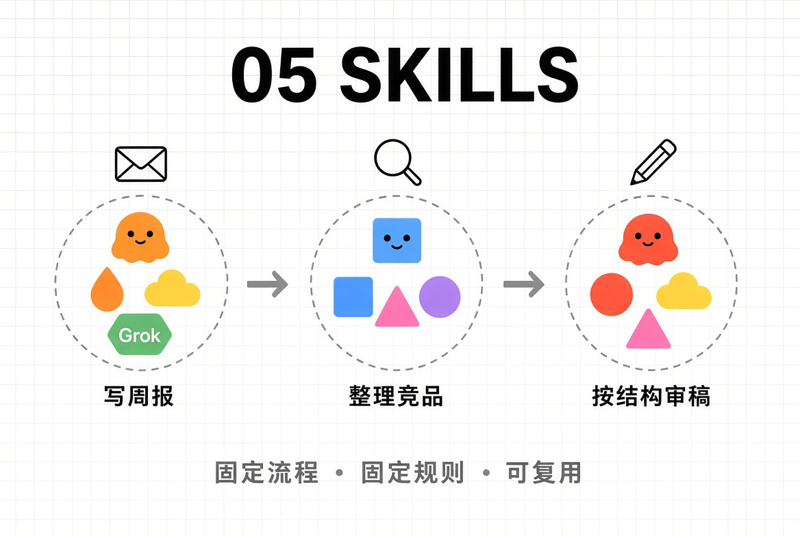
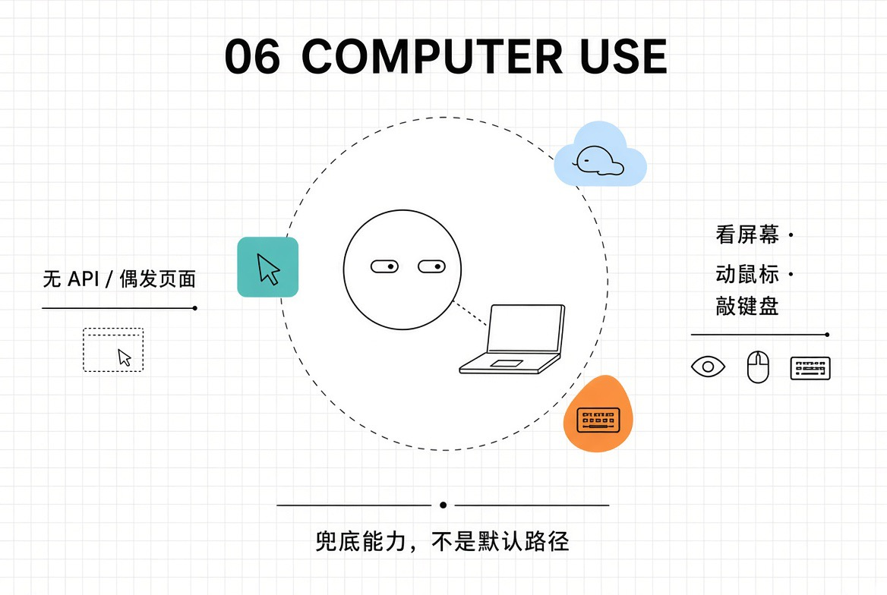
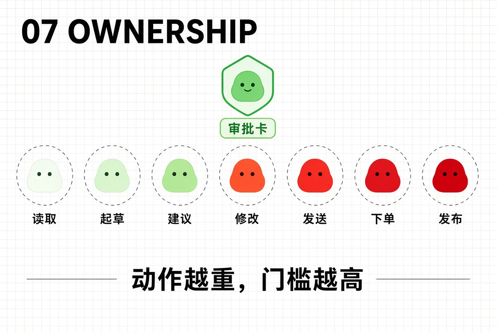
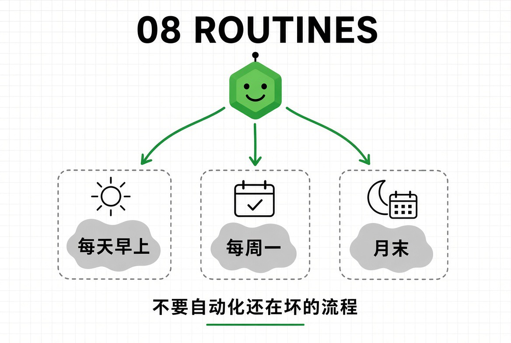
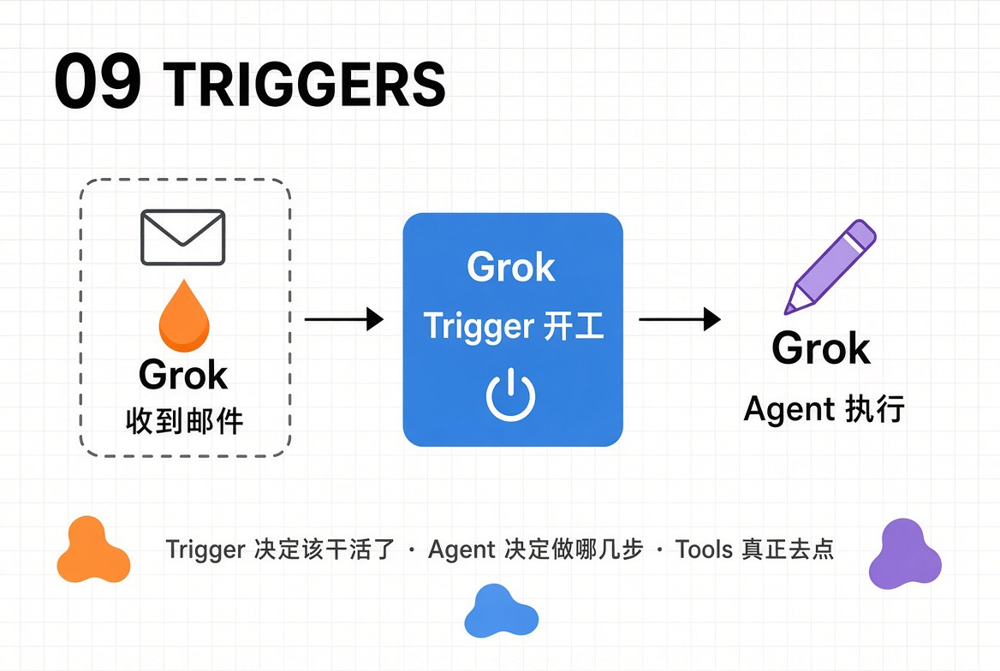
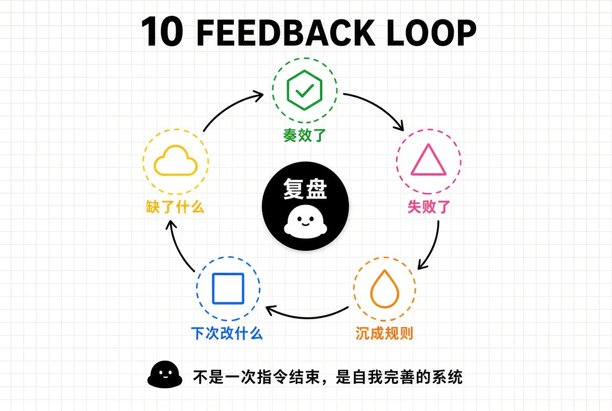

# Saved x bookmark 2099726083532992780

Gork Bot的从零开始使用指南 如果你今天才开始用 Grok Bot，别着急一上来就搭一支庞大的 Agent 团队。

## Source details

- Source: https://x.com/TodayKan/status/2099726083532992780
- Author: @TodayKan
- Created: 2026-09-15T05:04:43Z

## Captured content

Gork Bot的从零开始使用指南

如果你今天才开始用 Grok Bot，别着急一上来就搭一支庞大的 Agent 团队。
先理清这十个概念，一旦理解了底层逻辑，后面做什么都会轻松很多。
1. Agent 到底是什么
Agent

如果你今天才开始用 Grok Bot，别着急一上来就搭一支庞大的 Agent 团队。

先理清这十个概念，一旦理解了底层逻辑，后面做什么都会轻松很多。

1. Agent 到底是什么

Agent 不只是「换了个名字的聊天机器人」。你不是只问它一个问题，而是交给它一个任务。它会自己拆解、尝试、再根据结果继续做。

让Agent知道自己要做什么：明确需求、了解边界、不给笼统的描述，让它知道用什么工具去处理什么信息。因为它能力很强，所以要让它有边界感。

先做出一个真正有用的 Agent，再做出“专业团队”

一个「只负责每天整理你关注领域重点信息与要点」的 Agent，比一个「什么都管」的万能助手可能更会提高你的效率。

2. Context上下文

Context，就是 AI回答问题时能参考的“前后信息”。

它包括你刚刚说的话、之前的对话、提供的资料、文件内容、系统规则，以及当前任务背景。

没有上下文，AI 只能靠猜。

你突然说“它太贵了”，别人必须知道“它”是什么。AI也是一样。

先说清楚任务目标：要做什么。

补充关键资料：原文、文件、报错或限制。

说明使用场景：给谁看、在哪里用。

写出优先级：什么最重要，什么不能做。

长对话中，阶段性总结重点。

还要分清两层：

- 这次对话里的上下文：当前任务、刚贴的材料

- 长期记忆：说一次就能跨对话记住的偏好、规则、事实

好上下文不是把所有东西都塞进去，而是把相关信息放到模型眼前。

3. 插件（Plugins）

可以把插件理解成「整合」，让 Grok Bot 能直接用上别的 App 或服务。

通常这是给 Agent 接入外部能力最省事的方式，不用自己从零搭连接。

比如：邮件、日历、GitHub、Slack，或其他常用工具。

4. MCP

MCP 全称是 Model Context Protocol（模型上下文协议）。

可以把它看成：AI Agent 连接外部工具、数据

它更像底层的连接框架，更符合Al调用的规范。比如某论文网站出了MCP服务，意味着你可以用AI 直接访问它的数据库了。相比 API来说，MCP 可以直直接调用，而API 则需要先让AI写代码才能调用。

通过标准化协议，连接各种数据源、工具和服务上下文共享

在安全的上下文中共享信息，提升模型理解能力

让模型可以发现并调用外部工具完成真实任务

内置权限管理与数据隔离，保障数据安全

可扩展与生态开放

支持自定义扩展，构建丰富的MCP生态

5. Skills

skill是封装了固定工作流程、规则、提示词、校验逻辑的可复用AI能力模块，相当于预制工作流/专属技能插件/，专为标准化、重复性办公场景设计，区别于普通聊天指令。

它不是插件（插件负责连上工具），也不是日程（日程负责何时跑）。

如：「写周报」「整理竞品信息」「按固定结构审稿」

6. Computer use

也叫 Computer-Using Agent / CUA指的是：AI 像人一样“看屏幕、动鼠标、敲键盘”，直接操作电脑上的软件和网页，而不需要对方提供 API。

它不是另一种模型，而是给现有大模型加上“眼睛 + 手”的能力。

Computer Use = 让 AI 把电脑当给人用的工具来用，而不是只通过聊天或专用接口。

7. 所有权（Handoffs and ownership）

不要给每个 Agent 开「什么都能做」的权限。

明确它能做什么：

- 读取

- 起草

- 建议

- 修改

- 发送

- 下单 / 购买

- 发布

越重要的决策审批门槛就要越高

在 Grok Bot 里，很多重大动作会先弹确认（审批卡），不是默认全开。先把「能建议」和「能直接执行」分开，会安心很多。

这一条放在自动化之前，是因为：还没设边界，就先排程、先触发，风险会放大。

8. 例行任务（Routines）

Grok Bot 真正开始好用，往往从这里开始。

当某个任务已经跑得稳了，就把它排进日程：

- 每天早上

- 每周一

- 月末

- 或定期需要检查的时候

入门例子：每天 9 点汇总未读邮件 / 待办，而不是每次都说「帮我看看今天做什么」。

但要记住，「已经验证过的流程」再自动化

9. 触发器（Triggers）

规定「什么时候开始干活」。

上面提到过的Computer Use 讲的是 AI 看屏幕、使用鼠标。Trigger 讲的是 AI 什么时候开工。没有 Trigger，Agent 只能等你开口；有了 Trigger，它就能自己开始工作。

Trigger = 某个条件成立时，自动把一条任务丢给 Agent 去执行。

当收到邮件时

当添加文件时

当提交表格时

可以这样理解一条完整链路：

1. Trigger 决定「该干活了」

2. Agent 决定「要做哪几步」

3. Computer Use / Tools 真正去点、去填、去调接口

10. 反馈闭环

Feedback loop（反馈循环） 就是：系统做完一步，看结果，再根据结果决定下一步。不是一次下达指令就结束。

重要任务做完后反思

- 什么奏效了？

- 什么失败了？

- 缺了什么？

- 下次该改什么？

- 什么该变成永久规则 / 记忆 / 技能？

目标不只是「让 Grok Bot 能干活」。

而是建立一个：每用一次就会自我完善的系统

等单个 Agent 已经稳了，再考虑Grok 多 Bot / 团队协作，后面也会更新相关内容
